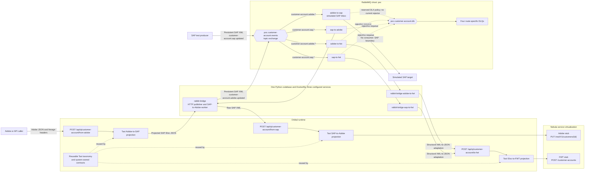
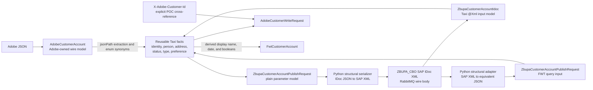
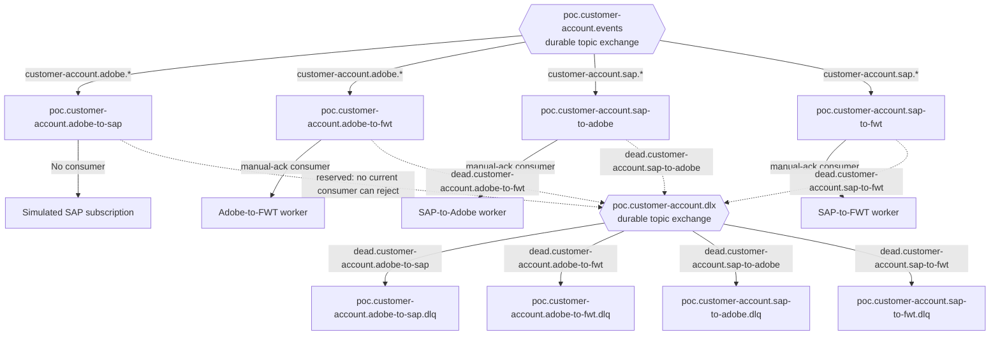
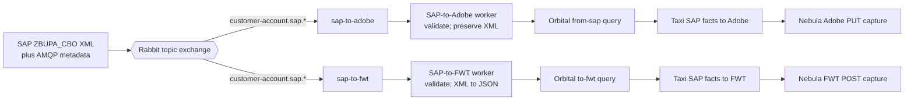
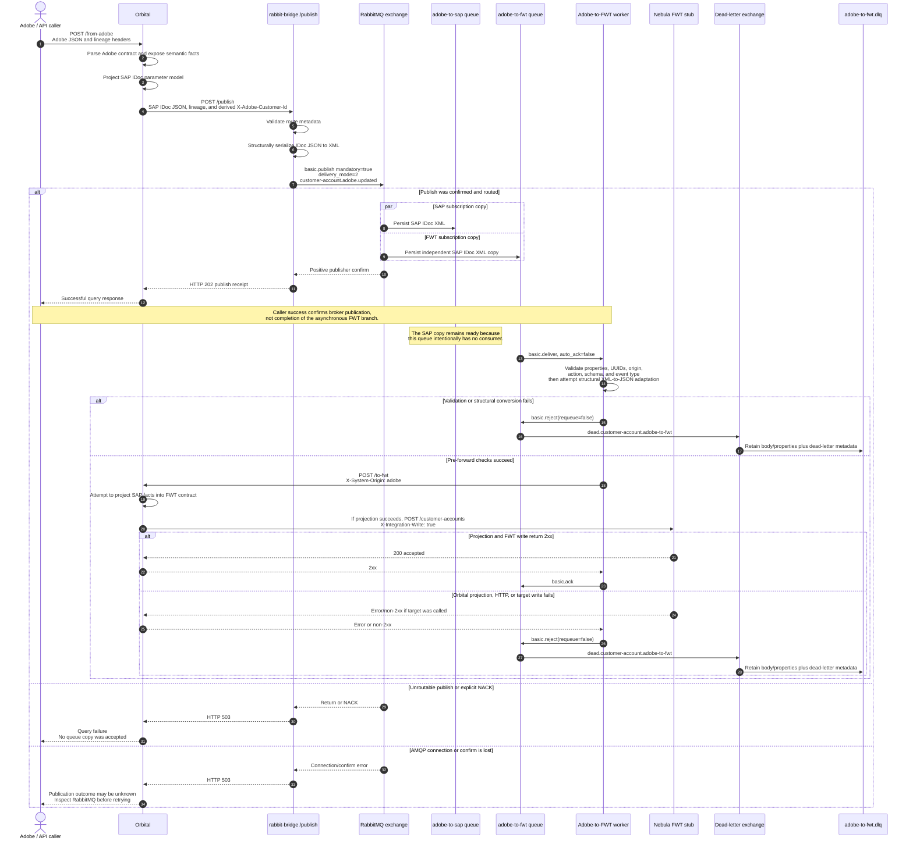
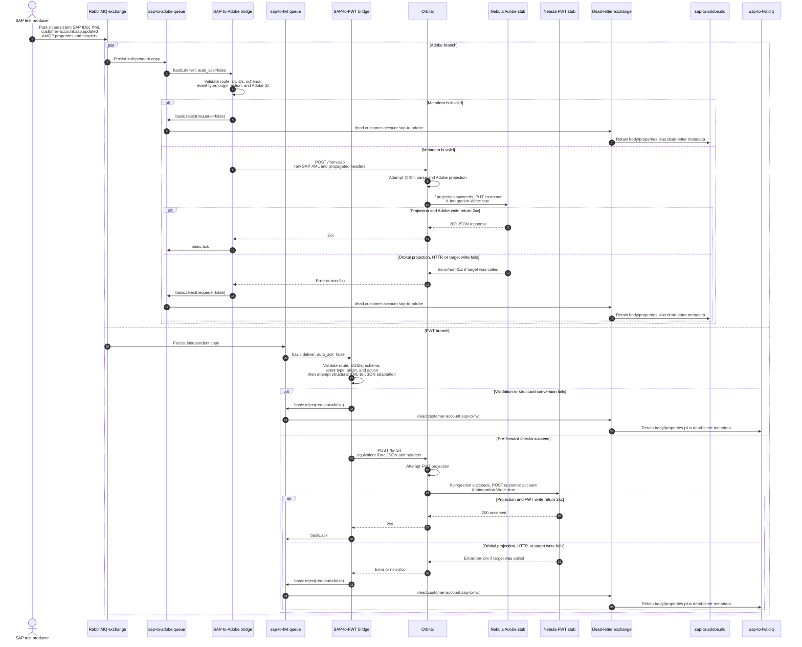
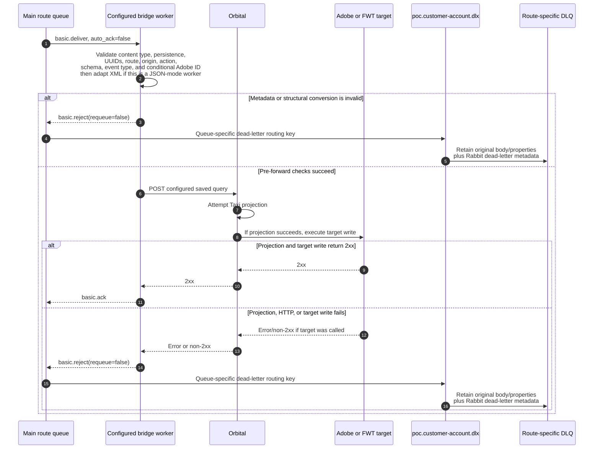
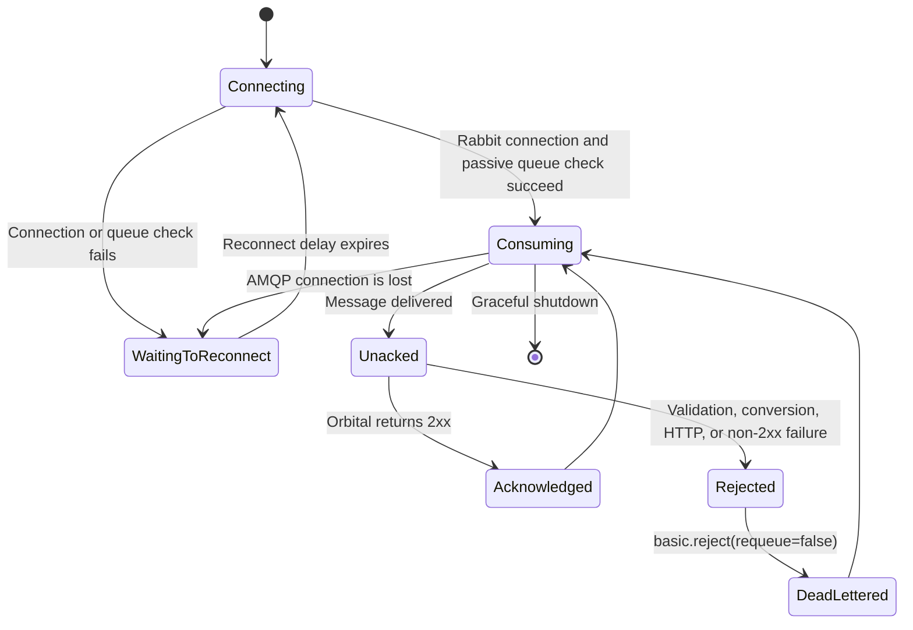

# Orbital Customer Account Integration POC

This repository is an end-to-end Orbital/Taxi proof of concept for customer-account integration between Adobe, SAP, and FWT. RabbitMQ replaces the production message broker and the SAP boundary, while Nebula replaces the real Adobe and FWT HTTP endpoints.

The implemented paths are:

| Source event | RabbitMQ subscriptions | Result |
|---|---|---|
| Adobe update | `adobe-to-sap` and `adobe-to-fwt` | A SAP `ZBUPA_CBO` IDoc is retained in the simulated SAP inbox; an independent copy is projected and posted to FWT. |
| SAP update | `sap-to-adobe` and `sap-to-fwt` | Independent copies are projected and written to the Adobe and FWT stubs. |
| FWT event | None | No FWT-origin route exists. FWT is an outbound target only. |

The POC is update-only, uses synthetic customer data, and keeps business transformation in Taxi. The Python bridge performs transport and structural format adaptation only.

Current verification snapshot:

- Orbital package `com.lalit/orbital-poc` is Healthy with 11 Taxi sources, 0 warnings, and 0 errors.
- The Python bridge has 41 passing tests; Ruff and Python byte-compilation pass.
- Adobe-origin and SAP-origin FWT writes match `test-data/expected-fwt-update.json`.
- SAP-origin Adobe writes match `test-data/expected-adobe-update.json`.
- Adobe-origin SAP XML matches `test-data/expected-sap-update.xml` semantically.
- Both development Compose models validate; in the isolated development stack all three consumers connect, and the four main queues have independent dead-letter queues.

## Contents

- [Purpose and scope](#purpose-and-scope)
- [Architecture](#architecture)
- [Why Taxi, the Python bridge, RabbitMQ, and Nebula exist](#why-taxi-the-python-bridge-rabbitmq-and-nebula-exist)
- [Taxi semantic modelling](#taxi-semantic-modelling)
- [RabbitMQ topology](#rabbitmq-topology)
- [End-to-end flow diagrams](#end-to-end-flow-diagrams)
- [Detailed sequence diagrams](#detailed-sequence-diagrams)
- [HTTP and message contracts](#http-and-message-contracts)
- [Delivery, failure, and loop-prevention semantics](#delivery-failure-and-loop-prevention-semantics)
- [Repository layout and file-by-file reference](#repository-layout-and-file-by-file-reference)
- [Runtime configuration](#runtime-configuration)
- [Run the POC locally](#run-the-poc-locally)
- [Deploy to the existing Git-workspace Orbital instance](#deploy-to-the-existing-git-workspace-orbital-instance)
- [Smoke tests](#smoke-tests)
- [Automated tests](#automated-tests)
- [Troubleshooting](#troubleshooting)
- [Known limitations and continuation work](#known-limitations-and-continuation-work)
- [How to extend the POC safely](#how-to-extend-the-poc-safely)
- [BIP traceability](#bip-traceability)

## Purpose and scope

The POC demonstrates that reusable Taxi data definitions can connect three different system-owned wire contracts without creating a single shared physical customer model.

It proves the following design:

1. Adobe JSON enters an Orbital saved query.
2. Taxi exposes the reusable customer facts inside the Adobe payload and projects them into a SAP IDoc model.
3. Orbital calls the Python bridge over HTTP; the bridge serializes the already-projected IDoc as XML and publishes it to RabbitMQ.
4. RabbitMQ fans the event out to independent target subscriptions.
5. Queue-specific bridge workers validate the message, call an Orbital saved query, and acknowledge only after the target write succeeds.
6. Taxi projects the SAP facts into independent Adobe or FWT target contracts.
7. Nebula captures the final HTTP writes so the exact target payload can be inspected without external credentials or side effects.

### What is real in this POC

- The Adobe, SAP, and FWT wire shapes used by the selected field slice.
- Taxi semantic types, enum synonyms, projections, saved queries, and HTTP write operations.
- RabbitMQ topic routing, persistent messages, publisher confirms, manual acknowledgements, and dead-lettering.
- HTTP-to-AMQP and AMQP-to-HTTP transport through the Python bridge.
- Docker networking and the Orbital disk-workspace loading model.
- Deterministic synthetic fixtures and exact expected target payloads.

### What is simulated

- The SAP target is the durable `poc.customer-account.adobe-to-sap` queue. It intentionally has no consumer in this POC.
- A SAP return/update is injected explicitly from `test-data/sap-update.xml`; the simulated SAP inbox does not automatically echo a response.
- Adobe and FWT are Nebula HTTP stubs that log requests and return deterministic success responses.
- The RabbitMQ management publish API is used only as a manual SAP smoke-test injector.

### What is deliberately out of scope

- Production Adobe, SAP, FWT, Azure Service Bus, or reference-data connectivity.
- Create flows. Only `UPDATE` / SAP `MSGFN=004` is enabled.
- Exactly-once delivery, durable idempotency, automatic retry queues, replay tooling, ordering guarantees, HA, TLS, and production authentication.
- Full FWT canonical-account parity.
- A FWT-origin customer-account on-ramp or return flow.

## Architecture

### End-to-end component view



### Component responsibilities

| Component | Owns | Does not own |
|---|---|---|
| Taxi source | Business meaning, system contracts, field extraction, enum/code equivalence, derived values, target request shapes, and orchestration calls. | AMQP connections, queue lifecycle, broker retries, or service virtualization. |
| Orbital | Compiles Taxi, exposes saved queries as HTTP endpoints, resolves semantic facts, executes projections, and invokes described HTTP services. | RabbitMQ transport in this local stack. |
| Python bridge | HTTP/AMQP adaptation, route metadata validation, XML/JSON structural conversion, confirms, consumer acknowledgement, reconnect state, and health reporting. | Customer status rules, names, address mapping, preference mapping, or target business models. |
| RabbitMQ | Durable topic routing, independent subscription copies, persistence, consumer delivery, acknowledgements, and dead-letter routing. | Semantic transformation. |
| Nebula | Disposable Adobe and FWT HTTP endpoints that capture the final request and return a deterministic response. | Messaging, assertions, persistence, or production behavior. |
| Postgres | Orbital runtime persistence supplied by the generated Orbital stack. | POC message transport or customer system-of-record storage. |

## Why Taxi, the Python bridge, RabbitMQ, and Nebula exist

### Why Taxi is the centre of the implementation

Adobe, SAP, and FWT use different names, structures, codes, and formats for the same business concepts. Taxi lets the contracts remain system-owned while declaring semantic equivalence through reusable types and enum synonyms.

For example:

- Adobe exposes status through a custom-attribute array.
- SAP carries status as `KATR5` codes such as `AC` and `BL`.
- FWT expects status strings such as `ACTIVE` and `BLOCKED`.
- All three values can be connected through the shared `CustomerAccountStatus` fact without a Python mapping table or one universal wire DTO.

The same approach keeps `AdobeCustomerId` and `SapCustomerNumber` deliberately distinct. They are both strings on the wire but are not interchangeable facts.

### Why the Python bridge exists

The deployed Orbital workspace has HTTP service connectivity but no configured supported RabbitMQ/AMQP Taxi connector. The bridge supplies that missing transport boundary.

It has two roles.

#### HTTP to AMQP publisher

The Adobe saved query projects Adobe JSON into `ZbupaCustomerAccountPublishRequest` and calls `POST /publish` on the bridge. The bridge:

1. validates UUID lineage, origin, action, schema, and event metadata;
2. accepts the projected IDoc as JSON or an already serialized XML document;
3. structurally serializes the JSON envelope to canonical `ZBUPA_CBO` XML when necessary;
4. publishes with `delivery_mode=2`, `mandatory=true`, and publisher confirms;
5. returns HTTP `202` only when RabbitMQ confirms a routable publish.

The JSON-to-XML step is required by an observed Orbital 0.38 runtime limitation: Orbital can deserialize an `@Xml` model, but its HTTP request factory cannot serialize that model through the raw-object overload used by the write operation. Taxi still creates every business value; Python only emits XML elements and known attributes.

#### AMQP to HTTP consumers

One bridge process consumes one configured queue. It:

1. passively checks that the queue already exists in RabbitMQ;
2. uses `prefetch=1` and manual acknowledgement;
3. validates the routing key and required AMQP properties/headers;
4. forwards the payload and lineage metadata to a configured Orbital saved query;
5. acknowledges only after Orbital returns a 2xx response;
6. rejects with `requeue=false` on validation, conversion, HTTP, or downstream failures, allowing RabbitMQ to dead-letter the message.

The SAP-to-Adobe worker forwards raw XML. The FWT workers convert the XML to the structurally equivalent `{ "IDOC": ... }` JSON envelope before calling Orbital. This avoids an observed concurrent XML-parser defect when the same SAP event is parsed by two saved queries at once. The adapter preserves element values as strings, XML attributes, whitespace inside values, and repeated children; it does not derive or rename customer facts.

The bridge is intentionally small and replaceable. If the deployed Orbital edition gains a supported RabbitMQ connector with the required acknowledgement and metadata behavior, the Python transport can be removed without redesigning the Taxi contracts.

### Why RabbitMQ exists

RabbitMQ replaces the production asynchronous broker and the SAP subscription boundary. A durable topic exchange provides source-based fan-out:

- one Adobe event creates an independent SAP-inbox copy and FWT copy;
- one SAP event creates an independent Adobe copy and FWT copy;
- a failure in one target route does not roll back or block the other route;
- positive bindings make the permitted routes explicit and prevent source-system echo routing.

RabbitMQ also makes acknowledgement timing, persistence, unroutable publishes, and route-specific dead-lettering visible in a local POC.

### Why Nebula exists

Nebula is a development-only target simulator. It proves that Orbital completed the target projection and HTTP call without requiring Adobe/FWT credentials or causing external side effects.

The script provides:

- `PUT /rest/V1/customers/{adobeCustomerId}`, which logs `ADOBE_STUB_CAPTURE id=... body=...` and returns the ID;
- `POST /customer-accounts`, which logs `FWT_STUB_CAPTURE body=...` and returns `{ "status": "accepted" }`.

Nebula does not emulate RabbitMQ, store customer data, or assert payload correctness. The deterministic files in `test-data/` are the expected results; Nebula only makes the actual request observable in logs.

`orbital/config/services.conf` maps stable Taxi service names to Docker-network URLs, so the Taxi contracts do not contain environment-specific host ports. Nebula must not be used as a production target.

## Taxi semantic modelling

### Model layers and responsibility boundary



### Reusable semantic facts

`src/taxonomy/customer-account-types.taxi` defines narrow scalar facts instead of typing every field as `String` or `Boolean`. This prevents Taxi from satisfying a target field with a merely type-compatible but semantically wrong value.

Important examples are:

- `AdobeCustomerId` versus `SapCustomerNumber`;
- `CustomerFirstName` versus `CustomerLastName`;
- `AddressLine1` versus `AddressLine2`;
- `TelephoneNumber` versus `MobileNumber`;
- `DefaultShippingAddressFlag` versus `DefaultBillingAddressFlag`;
- message, correlation, and causation IDs as separate lineage facts.

`src/taxonomy/customer-account-enums.taxi` defines system-neutral meanings. System contracts declare their wire enum members as synonyms of those shared meanings.

### System-owned contracts

The POC does not create one canonical physical customer object that every system must use.

- Adobe retains nested JSON addresses and custom-attribute arrays.
- SAP retains its `ZBUPA_CBO` control, core, and secondary IDoc segments and XML attributes.
- FWT retains its nested customer, recipient, address, and preference structure.

The source contracts expose hidden facts and the target `parameter closed model` declarations tell Taxi exactly what must be constructed. `closed` keeps the wire shape deliberate; `parameter` models allow Taxi to populate fields from available semantic facts and expressions.

### Important transformations

| Business fact | Adobe representation | SAP representation | FWT representation | Rule |
|---|---|---|---|---|
| SAP customer number | `custom_attributes[sap_unique_id].value` | `ZBP_CBO/KUNNR` | `id`, `addressDetails.id` | Preserve as a string, including leading zeroes. |
| Adobe identity | top-level `id` | Not inserted into the IDoc | Not required | Reverse Adobe writes use explicit `X-Adobe-Customer-Id`; never infer it from `KUNNR`. |
| First/last name | `firstname`, `lastname` | `NAME1`, `NAME2` | nested names plus `name` | FWT display name is deterministic `first + " " + last`. |
| Date of birth | `dob` as `yyyyMMdd` | `RGDATE` as `yyyyMMdd` | `birthDate` as `yyyy-MM-dd` | FWT uses explicit string slicing; there is no current-time fallback. |
| Address lines | default billing `street[0..1]` | `STRAS`, `PSOO4` | `street`, `buildingName` | Adobe ingress selects the default billing address. |
| Town/postcode/country/region | nested address fields | `ORT01`, `PSTLZ`, `LAND1`, `REGIO` | nested address fields | Direct semantic mapping; optional region remains optional. |
| Telephone/mobile | `telephone`, `alt_telephone` | `TELF1`, `MOB_NUMBER` | `phoneNumber`, `cellphone` | Distinct reusable facts prevent substitution. |
| Status | custom strings such as `ACTIVE` | `KATR5`: `AC`, `BL`, `DC`, `DE`, `IN`, `OH` | FWT status strings | Taxi enum synonyms declare the code equivalence. |
| Contact preference | separate email/post flags (`1/0` ingress and `true/false` reverse write) | `KATR10`: `EML`, `PST`, `PEM`, `NON` | separate post/email booleans | Adobe flags combine into one shared preference and are expanded again per target. |
| Account group | no first-slice field | `KTOKD`: `1` or `2` | `INDIVIDUAL` or `ORGANISATION` | The enabled forward slice defaults to individual. |
| Account type | no first-slice field | `KATR1`: `01`, `02`, `03` | `RETAIL`, `WHOLESALE`, `WINECLUB` | The enabled forward slice defaults to retail. |
| Action | HTTP header `UPDATE` | `MSGFN=004` | `actionCode=UPDATE` | Update is the only enabled action. |

### SAP input and output models

`sap-customer-account.taxi` contains two structurally identical top-level models for a runtime-specific reason:

- `ZbupaCustomerAccountIdoc` is annotated `@Xml` and is used to deserialize raw SAP XML on the SAP-to-Adobe path.
- `ZbupaCustomerAccountPublishRequest` is a plain parameter model and is used for outbound HTTP projection and the FWT JSON ingress workaround.

Both describe the same `IDOC` content. The bridge conversion is therefore a format change, not a second business model.

## RabbitMQ topology

### Exchanges, queues, and dead-letter routes



There are four business/main queues and four supporting DLQs. The two FWT business queues are:

- `poc.customer-account.adobe-to-fwt`;
- `poc.customer-account.sap-to-fwt`.

Each FWT route has a separate queue because each source event must have an independent delivery state, acknowledgement, and failure record.

### Topology table

| Object | Type/binding | Consumer | Purpose |
|---|---|---|---|
| `poc.customer-account.events` | durable topic exchange | n/a | Receives customer-account events and creates one copy per matching target subscription. |
| `poc.customer-account.adobe-to-sap` | `customer-account.adobe.*` | none | Durable simulated SAP inbox. A successful Adobe smoke-test message remains here until inspected or removed. |
| `poc.customer-account.adobe-to-fwt` | `customer-account.adobe.*` | `rabbit-bridge-adobe-to-fwt` | Independent Adobe-origin FWT delivery. |
| `poc.customer-account.sap-to-adobe` | `customer-account.sap.*` | `rabbit-bridge` | Independent SAP-origin Adobe delivery. |
| `poc.customer-account.sap-to-fwt` | `customer-account.sap.*` | `rabbit-bridge-sap-to-fwt` | Independent SAP-origin FWT delivery. |
| `poc.customer-account.dlx` | durable topic exchange | n/a | Routes terminally rejected messages by route-specific dead-letter key. |
| `*.dlq` | one durable queue per main queue | none | Retains failed messages for manual diagnosis or later replay tooling. |

`customer-account.fwt.*` has no binding. No queue is bound to `customer-account.#` because that would make loop prevention and allowed source-to-target routes ambiguous.

The `adobe-to-sap.dlq` and its DLX binding are provisioned for symmetry and a future SAP consumer. They are inactive today: `adobe-to-sap` has no consumer, TTL, or max-length policy, so no current component rejects or expires its messages.

## End-to-end flow diagrams

### Adobe-origin flow

```mermaid
flowchart LR
    Input["Adobe update JSON"]
    FromAdobe["Orbital from-adobe query"]
    SapProjection["Taxi Adobe facts to SAP IDoc"]
    Publish["Bridge /publish<br/>JSON to XML"]
    Exchange{{"Rabbit topic exchange"}}
    SapQueue["adobe-to-sap<br/>persistent simulated inbox"]
    FwtQueue["adobe-to-fwt"]
    FwtWorker["Adobe-to-FWT worker<br/>validate and XML to JSON"]
    ToFwt["Orbital to-fwt query"]
    FwtProjection["Taxi SAP facts to FWT"]
    FwtStub["Nebula FWT POST capture"]

    Input --> FromAdobe --> SapProjection --> Publish --> Exchange
    Exchange -->|"customer-account.adobe.*"| SapQueue
    Exchange -->|"customer-account.adobe.*"| FwtQueue
    FwtQueue --> FwtWorker --> ToFwt --> FwtProjection --> FwtStub
```



The FWT copy contains the same SAP XML body as the simulated SAP-inbox copy. RabbitMQ does not contain an FWT-shaped message. Taxi produces the FWT request only when the FWT worker calls the saved query.

### SAP-origin flow



The two branches are independent. For example, a missing Adobe cross-reference can dead-letter the Adobe copy while the FWT copy still succeeds.

## Detailed sequence diagrams

### Adobe update to SAP and FWT



### SAP update to Adobe and FWT



### Generic consumer acknowledgement and dead-letter sequence



### Consumer state lifecycle



## HTTP and message contracts

### Orbital saved-query endpoints

| Endpoint | Input | Called by | Side effect |
|---|---|---|---|
| `POST /api/q/customer-account/from-adobe` | Adobe JSON plus typed lineage/origin/action headers | Smoke-test client or future Adobe on-ramp | Taxi projects SAP IDoc data and calls the bridge publisher. |
| `POST /api/q/customer-account/from-sap` | Raw `ZBUPA_CBO` XML plus lineage and explicit Adobe ID | `rabbit-bridge` SAP-to-Adobe consumer | Taxi projects the Adobe write body and calls the Adobe service. |
| `POST /api/q/customer-account/to-fwt` | Structurally equivalent IDoc JSON plus lineage/origin/action headers | Either FWT worker | Taxi projects the FWT write body and calls the FWT service. |

These are orchestration endpoints published from Taxi saved queries. The HTTP method `POST` describes invoking the integration, not necessarily the downstream business method.

### Downstream Taxi services

| Logical service | Operation | Runtime target in this POC | Notes |
|---|---|---|---|
| `RabbitBridgeService` | `POST /publish` | `http://rabbit-bridge:8080` | Receives projected IDoc JSON and lineage headers; returns a publish receipt. |
| `AdobeCustomerService` | `PUT /rest/V1/customers/{adobeCustomerId}` | Nebula | Sends `{ "customer": ... }`, lineage headers, and `X-Integration-Write: true`. |
| `FwtCustomerService` | `POST /customer-accounts` | Nebula | Always uses HTTP POST; update intent is represented by `actionCode=UPDATE`. |

### Bridge HTTP API

#### `POST /publish`

Accepted content types:

- `application/json`: the body must contain exactly one `IDOC` object and is serialized to SAP XML;
- `application/xml` or `text/xml`: the body is published as supplied after metadata validation.

Responses:

| Status | Meaning |
|---|---|
| `202` | RabbitMQ confirmed a routable publish. This does not mean every asynchronous consumer has completed. |
| `400 INVALID_SAP_PAYLOAD` | The projected JSON envelope is malformed. |
| `400 INVALID_ROUTE_METADATA` | Required lineage or route metadata is missing, malformed, or inconsistent. |
| `400 EMPTY_BODY` | No request body was supplied. |
| `415 UNSUPPORTED_MEDIA_TYPE` | The content type is not one of the three supported values. |
| `503 UNROUTABLE` | `mandatory=true` found no matching queue binding. |
| `503 PUBLISH_FAILED` | RabbitMQ NACKed the message or the AMQP connection failed. |

#### `GET /health`

The endpoint returns:

- HTTP `200` with `status=ok` when the configured consumer thread is running and connected;
- HTTP `503` with `status=degraded` and `last_error` when the consumer is not connected;
- HTTP `200` with `consumer.enabled=false` when consumer startup is explicitly disabled.

### HTTP lineage headers

| Header | Required | Meaning |
|---|---|---|
| `X-Message-Id` | yes | UUID identifying this event. Preserve it across delivery retries. |
| `X-Correlation-Id` | yes | UUID grouping related events in the business flow. |
| `X-Causation-Id` | no | UUID of the event that caused this deliberately new event. |
| `X-System-Origin` | yes | `adobe` or `sap` for implemented routes. Must agree with the routing key. |
| `X-Account-Action` | yes | `UPDATE`; create is not enabled. |
| `X-Schema` | defaulted on publish | `sap.zbupa-cbo.v1`. |
| `X-Event-Type` | defaulted on publish | `customer-account.updated.v1`. |
| `X-Adobe-Customer-Id` | SAP-to-Adobe only | Explicit POC cross-reference used in the Adobe target URL. |
| `X-Integration-Write` | target writes/optional transport fact | Marks a write created by the integration so a future on-ramp can suppress re-emission. |

Message, correlation, and optional causation IDs are validated as UUIDs by the bridge.

### RabbitMQ message contract

The Rabbit body is always SAP `ZBUPA_CBO` XML, even on an FWT subscription.

| AMQP property/header | Required | Value or meaning |
|---|---|---|
| routing key | yes | `customer-account.adobe.updated` or `customer-account.sap.updated`. |
| `content_type` | yes | `application/xml`. |
| `delivery_mode` | yes | `2`, making the message persistent when used with durable topology. |
| `message_id` | yes | UUID. |
| `correlation_id` | yes | UUID. |
| `type` | yes | `customer-account.updated.v1`. |
| `x-origin` | yes | Must equal the origin segment of the routing key. |
| `x-action` | yes | Must be `UPDATE` and agree with routing suffix `updated`. |
| `x-schema` | yes | `sap.zbupa-cbo.v1`. |
| `x-causation-id` | no | UUID lineage link. |
| `x-adobe-customer-id` | SAP-to-Adobe route only | Explicit Adobe identity. FWT routes do not require it. |
| `x-integration-write` | no | Boolean integration-write marker. |

The parser recognizes the syntactic routing suffix `created`, but every implemented route applies `allowed_actions={UPDATE}` and the Taxi business enum contains only `UPDATE`. A create event is therefore rejected.

## Delivery, failure, and loop-prevention semantics

### Publisher semantics

- The bridge uses a thread lock around a reused Pika connection/channel.
- Publisher confirms are enabled.
- `mandatory=true` turns missing bindings into a visible `UNROUTABLE` response.
- Messages use `delivery_mode=2` and the queues/exchanges are durable.
- HTTP `202` proves broker acceptance and routing only; it does not wait for target consumers.

### Consumer semantics

- Each process owns one queue and passively declares it, so topology mistakes fail visibly instead of creating an accidental queue.
- `prefetch=1` limits each worker to one unacknowledged delivery at a time.
- `auto_ack=false` keeps the delivery unacknowledged during validation, Orbital projection, and target HTTP execution.
- A 2xx from Orbital causes `basic.ack`.
- Invalid metadata, structural conversion failure, HTTP exception, or non-2xx causes `basic.reject(requeue=false)`.
- RabbitMQ then routes the message through the DLX to that route's DLQ.
- There is no automatic retry stage, retry backoff, or automated replay.

### Loop prevention

The POC uses several independent controls:

1. Positive topic bindings route Adobe events only to SAP/FWT subscriptions and SAP events only to Adobe/FWT subscriptions.
2. No queue is bound to `customer-account.fwt.*`.
3. The bridge validates that routing key, origin header, action header, schema, event type, and worker configuration agree.
4. Target Taxi services send `X-Integration-Write: true`.
5. The Nebula stubs do not emit new source events.
6. The simulated SAP queue does not automatically publish a return event; a SAP-origin fixture is a separate explicit action with its own lineage.

These controls prevent transport echo in the POC. They do not provide production idempotency. An Adobe event followed later by its SAP confirmation can legitimately create two FWT POSTs through different queues. That is fan-out, not a message loop, but a business-key/version deduplication decision is required if only one FWT effect is acceptable.

## Repository layout and file-by-file reference

The Git repository contains 50 meaningful source/configuration/fixture/documentation files. `.git`, virtual environments, bytecode, pytest caches, and Ruff caches are excluded from this inventory because they are generated artifacts.

```text
orbital-poc/
├── .gitignore
├── README.md
├── taxi.conf
├── docs/
│   ├── Orbital-Customer-Account-POC-Case-Study.md
│   ├── Orbital-Customer-Account-POC-Case-Study.docx
│   ├── build_case_study_docx.py
│   └── assets/
│       ├── case-study-architecture.mmd
│       ├── case-study-architecture.png
│       ├── case-study-sequence.mmd
│       ├── case-study-sequence.png
│       ├── case-study-journey.mmd
│       └── case-study-journey.png
├── orbital/
│   ├── config/
│   │   └── services.conf
│   └── nebula/
│       └── customer-account.nebula.kts
├── src/
│   ├── taxonomy/
│   │   ├── customer-account-types.taxi
│   │   └── customer-account-enums.taxi
│   ├── contracts/
│   │   ├── adobe-customer-account.taxi
│   │   ├── sap-customer-account.taxi
│   │   └── fwt-customer-account.taxi
│   ├── queries/
│   │   ├── adobe-to-sap.taxi
│   │   ├── sap-to-adobe.taxi
│   │   └── idoc-to-fwt.taxi
│   └── services/
│       ├── rabbit-bridge-service.taxi
│       ├── adobe-customer-service.taxi
│       └── fwt-customer-service.taxi
├── rabbit-bridge/
│   ├── .dockerignore
│   ├── .gitignore
│   ├── Dockerfile
│   ├── requirements.txt
│   ├── requirements-dev.txt
│   ├── pytest.ini
│   ├── app/
│   │   ├── __init__.py
│   │   ├── config.py
│   │   ├── metadata.py
│   │   ├── sap_xml.py
│   │   ├── publisher.py
│   │   ├── consumer.py
│   │   └── main.py
│   └── tests/
│       ├── test_config.py
│       ├── test_metadata.py
│       ├── test_sap_xml.py
│       ├── test_publisher.py
│       ├── test_consumer.py
│       └── test_http_publish.py
└── test-data/
    ├── adobe-update.json
    ├── expected-sap-update.xml
    ├── sap-update.xml
    ├── expected-adobe-update.json
    ├── expected-fwt-update.json
    └── rabbit-message-metadata.json
```

### Root files

| File | What it does and why it exists |
|---|---|
| `.gitignore` | Excludes Python bytecode, virtual environments, pytest/Ruff caches, and Microsoft Office lock files so generated artifacts do not pollute the Taxi repository. |
| `README.md` | This architecture, operations, testing, troubleshooting, and continuation guide. It is intended to be sufficient for a new engineer to understand and resume the POC. |
| `taxi.conf` | Defines package `com.lalit/orbital-poc` version `0.1.0`, uses `src/` as the Taxi source root, and includes project-local service configuration and Nebula scripts as additional Orbital sources. |

### Case-study documentation

| File | What it does and why it exists |
|---|---|
| `docs/Orbital-Customer-Account-POC-Case-Study.md` | Maintains the editable source for the decision-oriented case study. It explains the requirement, implementation journey, evidence, challenges, Azure/BIP comparison, architectural implications, recommendation, and production decision gates without duplicating this README's runbook role. |
| `docs/Orbital-Customer-Account-POC-Case-Study.docx` | Provides the polished, macro-free Word deliverable for upload to Google Drive and opening in Google Docs. It embeds the diagrams and uses standard Office Open XML, Arial fonts, tables, headers, footers, and page fields. |
| `docs/build_case_study_docx.py` | Rebuilds the DOCX deterministically from the Markdown source using `python-docx`. It owns presentation styling, Markdown-to-Word conversion, embedded diagrams, metadata, page fields, callouts, and accessibility descriptions; it does not alter POC runtime behavior. |
| `docs/assets/case-study-architecture.mmd` | Mermaid source for the simplified case-study architecture, separating semantic projection from transport and simulated endpoints. Keeping the source makes the embedded diagram reviewable and editable. |
| `docs/assets/case-study-architecture.png` | Rendered architecture image embedded in the DOCX for portable Google Docs/Word display. |
| `docs/assets/case-study-sequence.mmd` | Mermaid source for the generic publish/fan-out/acknowledgement sequence used by the case study. |
| `docs/assets/case-study-sequence.png` | Rendered sequence image embedded in the DOCX so the document has no external image dependency. |
| `docs/assets/case-study-journey.mmd` | Mermaid source for the three-stage implementation path. It replaces several pages of narrative with one editable visual. |
| `docs/assets/case-study-journey.png` | Rendered implementation-path image embedded in the DOCX for portable Word and Google Docs display. |

### Orbital-specific files

| File | What it does and why it exists |
|---|---|
| `orbital/config/services.conf` | Maps Taxi logical service names `rabbit-bridge`, `adobe-stub`, and `fwt-stub` to Docker-network URLs. This separates environment addresses from Taxi contracts. Both target stubs resolve to Nebula using the runtime-provided `${NEBULA_HTTP_PORT}`. |
| `orbital/nebula/customer-account.nebula.kts` | Defines the Adobe PUT and FWT POST test endpoints, logs exact request bodies, and returns deterministic JSON. It provides observable downstream behavior without real credentials or side effects. |

### Taxi taxonomy files

| File | What it does and why it exists |
|---|---|
| `src/taxonomy/customer-account-types.taxi` | Declares reusable semantic scalar facts for lineage, identities, person/contact/address data, distinct address-role booleans, and transport result fields. Narrow types prevent accidental mapping based only on primitive type compatibility. |
| `src/taxonomy/customer-account-enums.taxi` | Declares system-neutral origin, action, status, group, type, contact-preference, and consent meanings. Adobe, SAP, and FWT enums link their wire values to these meanings with `synonym`. |

### Taxi contract files

| File | What it does and why it exists |
|---|---|
| `src/contracts/adobe-customer-account.taxi` | Models Adobe JSON ingress and Adobe write shapes. Adobe-owned IDs and custom-attribute keys remain local. `jsonPath` fields expose SAP number, status, consent, and default billing-address facts hidden inside arrays. Expressions combine email/post flags into one semantic preference. Write models reconstruct the exact `{ "customer": ... }` target payload and string-valued custom attributes. |
| `src/contracts/sap-customer-account.taxi` | Models SAP IDoc XML attributes, control record, customer segments, defaults, and code enums. It links SAP codes to shared facts and defines separate `@Xml` ingress and plain publish envelopes to work around Orbital XML runtime limitations without duplicating business rules. |
| `src/contracts/fwt-customer-account.taxi` | Defines the deterministic first FWT output slice and FWT-owned wire enums. Taxi derives display name, reformats date of birth, expands contact preference into email/post booleans, and constructs nested address/customer structures. Runtime timestamps, money, banks, and unsupported reference descriptions are intentionally omitted. |

### Taxi query files

| File | What it does and why it exists |
|---|---|
| `src/queries/adobe-to-sap.taxi` | Publishes `POST /api/q/customer-account/from-adobe`. It supplies Adobe JSON and lineage facts to Taxi and calls `RabbitBridgeService`, keeping Adobe-to-SAP business projection inside Orbital. |
| `src/queries/sap-to-adobe.taxi` | Publishes `POST /api/q/customer-account/from-sap`. It accepts raw XML plus transport headers and requires an explicit Adobe ID before calling the Adobe service. The explicit ID avoids treating SAP and Adobe identifiers as interchangeable. |
| `src/queries/idoc-to-fwt.taxi` | Publishes shared endpoint `POST /api/q/customer-account/to-fwt`. Both FWT workers invoke the same projection because both queues carry the same SAP IDoc business content. |

### Taxi service files

| File | What it does and why it exists |
|---|---|
| `src/services/rabbit-bridge-service.taxi` | Describes Orbital's outbound bridge `POST /publish`, including typed request/receipt and fixed schema/event headers. It is the explicit boundary between Taxi semantic projection and AMQP transport. |
| `src/services/adobe-customer-service.taxi` | Describes the Adobe customer PUT, path variable, typed request/response, lineage, JSON content type, and integration-write marker. Orbital uses it as the target for SAP-to-Adobe projection. |
| `src/services/fwt-customer-service.taxi` | Describes the FWT customer-account POST, typed request/response, lineage, JSON content type, and integration-write marker. Orbital materializes the FWT contract before invoking it. |

### Bridge packaging files

| File | What it does and why it exists |
|---|---|
| `rabbit-bridge/.dockerignore` | Removes tests, caches, bytecode, and local virtual environments from the Docker build context and runtime image. |
| `rabbit-bridge/.gitignore` | Provides bridge-local cache and bytecode exclusions in addition to the root ignore file. |
| `rabbit-bridge/Dockerfile` | Builds a Python 3.12 slim image, installs production dependencies only, creates UID 10001, runs as a non-root user, exposes port 8080, and starts `python -m app.main`. |
| `rabbit-bridge/requirements.txt` | Bounds the production libraries: FastAPI/Uvicorn for HTTP, Pika for AMQP, and HTTPX for forwarding to Orbital. |
| `rabbit-bridge/requirements-dev.txt` | Includes production dependencies plus pytest and Ruff for local checks. |
| `rabbit-bridge/pytest.ini` | Restricts discovery to `tests/` and enables quiet test output. |

### Bridge application files

| File | What it does and why it exists |
|---|---|
| `rabbit-bridge/app/__init__.py` | Marks `app` as a Python package and documents its transport-only responsibility. |
| `rabbit-bridge/app/config.py` | Defines immutable, environment-driven settings with boolean, integer, float, and enum-like validation. Generic consumer settings let one image run all three worker roles; legacy SAP-to-Adobe aliases preserve compatibility. |
| `rabbit-bridge/app/metadata.py` | Defines the transport contract. It parses exact routing keys, implements Rabbit topic-pattern matching, validates UUIDs and origin/action/schema/event consistency, validates persistent XML AMQP properties, handles the conditional Adobe cross-reference, and converts HTTP headers to AMQP metadata and back to Orbital headers. |
| `rabbit-bridge/app/sap_xml.py` | Implements strict structural IDoc JSON-to-XML and XML-to-JSON conversion. It understands `BEGIN` and `SEGMENT` attributes, omits null elements, preserves scalar strings and repeated children, escapes XML, and rejects unsupported envelopes. It contains no customer business mapping. |
| `rabbit-bridge/app/publisher.py` | Implements the locked Pika publisher, connection reuse, publisher confirms, mandatory routing, persistent message properties, and specific unroutable/NACK/AMQP errors. |
| `rabbit-bridge/app/consumer.py` | Implements consumer state, reconnect behavior, passive queue checking, prefetch, route validation, optional XML-to-JSON adaptation, HTTP forwarding, ACK-after-2xx, and reject-without-requeue behavior. |
| `rabbit-bridge/app/main.py` | Composes the FastAPI application. Lifespan starts/stops consumer and publisher resources; `/health` exposes consumer state; `/publish` validates content and metadata, performs structural serialization, calls the publisher in a threadpool, and returns precise HTTP errors. Module execution starts Uvicorn. |

### Bridge test files

| File | What it proves and why it exists |
|---|---|
| `rabbit-bridge/tests/test_config.py` | Proves generic worker environment variables, legacy fallbacks and precedence, default XML forwarding, and rejection of unsupported payload formats. |
| `rabbit-bridge/tests/test_metadata.py` | Proves positive HTTP/AMQP UUID-lineage mapping, route/origin/action mismatch rejection, the SAP-to-Adobe Adobe-ID requirement, relaxed FWT identity policy, and configured-origin mismatch rejection. The implementation also validates bad UUIDs, schema, event type, and persistence, but dedicated negative tests for those cases remain to be added. |
| `rabbit-bridge/tests/test_sap_xml.py` | Proves XML attributes, null omission, escaping, leading-zero/string preservation, repeated-element handling, and rejection of malformed JSON/XML envelopes. |
| `rabbit-bridge/tests/test_publisher.py` | Proves publisher confirms, mandatory routing, exchange/key selection, persistence, XML content type, and metadata propagation. |
| `rabbit-bridge/tests/test_consumer.py` | Proves ACK-after-success only, reject/no-requeue failure behavior, invalid-route short circuit, route-specific identity policy, raw XML forwarding, and FWT XML-to-JSON forwarding. |
| `rabbit-bridge/tests/test_http_publish.py` | Exercises FastAPI `/publish` and `/health`: raw XML, projected JSON serialization, invalid metadata/payload behavior, unroutable publishing, disabled-consumer health, and resource lifecycle. |

### Test fixture files

| File | What it represents and why it exists |
|---|---|
| `test-data/adobe-update.json` | Synthetic Adobe ingress fixture with nested default billing address and custom attributes. It is the source for Adobe-to-SAP and Adobe-origin FWT smoke tests. |
| `test-data/expected-sap-update.xml` | Expected SAP IDoc projected from the Adobe fixture. Its `SNDPRN=BIP` represents an integration-generated inbound SAP message. |
| `test-data/sap-update.xml` | Synthetic SAP-origin IDoc used for SAP-to-Adobe and SAP-to-FWT tests. `SNDPRN=SAP` distinguishes the source fixture from the integration-generated expected document. |
| `test-data/expected-adobe-update.json` | Exact Adobe `{ "customer": ... }` PUT body expected from the SAP fixture, including boolean consent strings. |
| `test-data/expected-fwt-update.json` | Exact deterministic FWT POST body expected from either source origin, including formatted DOB and derived contact-preference booleans. |
| `test-data/rabbit-message-metadata.json` | Companion AMQP metadata for manually publishing `sap-update.xml`: route, UUID lineage, event/schema, explicit Adobe cross-reference, and integration-write flag. Keeping metadata separate from XML documents the transport envelope clearly. |

## Runtime configuration

### A companion runtime folder is required

This Git repository does not contain Docker Compose or RabbitMQ definitions. Runtime support lives outside Git in an `orbital` directory. Two different workspace-loading modes are currently in use and must not be mixed.

#### Development bind-mount mode

The development stack at `C:\dev\bbnr` uses sibling directories:

```text
C:\dev\bbnr\
├── orbital/
│   ├── docker-compose.yml
│   ├── docker-compose.override.yml
│   ├── docker-compose.poc.yml
│   ├── rabbitmq/
│   │   ├── rabbitmq.conf
│   │   └── definitions.json
│   └── workspace/
│       └── workspace.conf
└── orbital-poc/
    └── ...this repository...
```

In this mode the directories must be siblings unless the two relative paths in `docker-compose.override.yml` are changed:

- `../orbital-poc` is mounted read-only into Orbital;
- `../orbital-poc/rabbit-bridge` is the bridge Docker build context.

This is the mode used by the isolated-port commands in this README.

#### Existing Git-workspace mode

The running installation at `C:\Users\lalit\orbital` is different. Its `workspace/workspace.conf` tells Orbital to poll the Git repository on branch `main` and manage its checkout under the runtime workspace:

```text
C:\Users\lalit\orbital\
├── docker-compose.yml
├── docker-compose.override.yml
├── rabbitmq\
├── workspace\workspace.conf
└── workspace\orbital\workspace\projects\orbital-poc\
    └── ...Orbital-managed Git checkout...
```

The target override must build the bridge from:

```text
./workspace/orbital/workspace/projects/orbital-poc/rabbit-bridge
```

Do not replace the target Git workspace configuration with the development bind-mount `workspace.conf`, and do not depend on a sibling `C:\Users\lalit\orbital-poc` clone for that deployment. Push repository changes to the configured branch and let Orbital update its managed checkout.

Compose project names isolate container names and named volumes, but they do not isolate writable host bind mounts. Do not start a second `orbital-poc` project from `C:\Users\lalit\orbital` using the same `./config` and `./workspace` directories. To run a genuinely separate stack, use a separate runtime support directory, as the `C:\dev\bbnr\orbital` development stack does, or parameterize separate bind roots.

### Companion runtime files

| File in `../orbital` | Purpose |
|---|---|
| `docker-compose.yml` | Generated Orbital base stack containing Orbital, Postgres, Nebula, and optional Prometheus. Keep this generated base separate from POC customizations. |
| `docker-compose.override.yml` | Adds RabbitMQ and defines the main bridge plus both FWT workers. Its project mount/build paths are mode-specific: sibling paths in development and the managed Git-checkout path in the existing installation. |
| `docker-compose.poc.yml` | Optional host-port overrides for a stack launched from its own runtime support directory. It does not isolate shared writable bind mounts when reused from the same directory. |
| `rabbitmq/rabbitmq.conf` | Imports definitions from `/etc/rabbitmq/definitions.json` and skips an unchanged definition set. |
| `rabbitmq/definitions.json` | Declares the fixed local user/vhost/permissions, two exchanges, four main queues, four DLQs, and eight bindings. |
| `workspace/workspace.conf` | In development, loads `/opt/service/projects/orbital-poc` from the read-only bind mount. In the existing installation, retains Git repository polling and the managed checkout under `/opt/service/orbital/workspace`. |

Definitions import owns the local RabbitMQ user hash. Changing only the Compose `RABBITMQ_DEFAULT_USER` or `RABBITMQ_DEFAULT_PASS` values does not replace the imported login.

### Bridge process roles

The same bridge source and Dockerfile are built for three independently configured Compose services. Because the Compose file does not declare a shared `image:` name, the services currently receive separate Compose image tags and may have different image IDs even though they use the same source:

| Compose service | Consumed queue | Expected origin | Adobe ID required | Orbital target | Format sent to Orbital |
|---|---|---|---|---|---|
| `rabbit-bridge` | `poc.customer-account.sap-to-adobe` | `sap` | yes | `/api/q/customer-account/from-sap` | raw XML |
| `rabbit-bridge-adobe-to-fwt` | `poc.customer-account.adobe-to-fwt` | `adobe` | no | `/api/q/customer-account/to-fwt` | structural JSON |
| `rabbit-bridge-sap-to-fwt` | `poc.customer-account.sap-to-fwt` | `sap` | no | `/api/q/customer-account/to-fwt` | structural JSON |

Only the main bridge receives a host port in isolated mode. The FWT workers expose port 8080 inside Compose so their health endpoints can be inspected with `docker compose exec`.

### Bridge environment variables

#### Rabbit connection and publisher

| Variable | Default | Purpose |
|---|---|---|
| `RABBITMQ_HOST` | `rabbitmq` | Broker host. |
| `RABBITMQ_PORT` | `5672` | AMQP port. |
| `RABBITMQ_USER` | `orbital` | POC broker user. |
| `RABBITMQ_PASSWORD` | `orbital-poc` | POC broker password; not a production secret. |
| `RABBITMQ_VHOST` | `poc` | Broker vhost. |
| `RABBITMQ_HEARTBEAT` | `30` | Pika heartbeat seconds. |
| `RABBITMQ_BLOCKED_CONNECTION_TIMEOUT` | `30` | Pika blocked-connection timeout seconds. |
| `RABBITMQ_EXCHANGE` | `poc.customer-account.events` | Publish exchange. |
| `RABBITMQ_ADOBE_TO_SAP_ROUTING_KEY` | `customer-account.adobe.updated` | Fixed route used by bridge `/publish`. |

#### Generic consumer

| Variable | Default | Purpose |
|---|---|---|
| `RABBITMQ_CONSUMER_QUEUE` | `poc.customer-account.sap-to-adobe` | The single queue owned by this process. |
| `RABBITMQ_CONSUMER_ROUTING_PATTERN` | `customer-account.sap.*` | Additional route-key validation; this does not create a broker binding. |
| `RABBITMQ_CONSUMER_EXPECTED_ORIGIN` | `sap` | Required message origin for this process. |
| `RABBITMQ_CONSUMER_REQUIRE_ADOBE_CUSTOMER_ID` | `true` | Whether `x-adobe-customer-id` is mandatory. |
| `RABBITMQ_CONSUMER_PREFETCH` | `1` | Maximum unacknowledged deliveries per worker. |
| `RABBITMQ_CONSUMER_ENABLED` | `true` | Starts or disables the background consumer. |
| `RABBITMQ_CONSUMER_RECONNECT_DELAY` | `5` | Delay in seconds between consumer reconnect attempts. |

Legacy fallback names remain supported: `RABBITMQ_SAP_TO_ADOBE_QUEUE`, `RABBITMQ_SAP_TO_ADOBE_ROUTING_PATTERN`, and `ORBITAL_SAP_TO_ADOBE_PATH`. The generic names take precedence when both are present.

#### Contract, Orbital, and HTTP server

| Variable | Default | Purpose |
|---|---|---|
| `CUSTOMER_ACCOUNT_SCHEMA` | `sap.zbupa-cbo.v1` | Required AMQP schema header. |
| `CUSTOMER_ACCOUNT_EVENT_TYPE` | `customer-account.updated.v1` | Required AMQP `type`. |
| `ORBITAL_BASE_URL` | `http://orbital:9022` | Orbital callback base URL. |
| `ORBITAL_CONSUMER_PATH` | `/api/q/customer-account/from-sap` | Saved query called by the consumer. |
| `ORBITAL_CONSUMER_PAYLOAD_FORMAT` | `xml` | `xml` or `json`; FWT workers use `json`. |
| `ORBITAL_TIMEOUT` | `30` | HTTP timeout seconds. |
| `HTTP_HOST` | `0.0.0.0` | FastAPI/Uvicorn bind address. |
| `BRIDGE_PORT` | `8080` | FastAPI/Uvicorn port. |

Boolean variables accept `1/true/yes/on` and `0/false/no/off`. Numeric settings reject values below their configured minimum, and payload format rejects anything other than `xml` or `json`.

### Isolated host-port variables

The development `docker-compose.poc.yml` supports these overrides. Use it from a separate runtime directory; changing ports and project name alone does not isolate shared `./config` or `./workspace` bind mounts:

| Variable | Default host port | Service/container port |
|---|---|---|
| `POC_ORBITAL_PORT` | `19022` | Orbital `9022` |
| `POC_POSTGRES_PORT` | `35432` | Postgres `5432` |
| `POC_NEBULA_PORT` | `18099` | Nebula `8099` |
| `POC_PROMETHEUS_PORT` | `19090` | Prometheus `9090` |
| `POC_RABBITMQ_PORT` | `25672` | RabbitMQ AMQP `5672` |
| `POC_RABBITMQ_MANAGEMENT_PORT` | `25673` | RabbitMQ management `15672` |
| `POC_BRIDGE_PORT` | `18080` | Main bridge `8080` |

## Run the POC locally

### Prerequisites

- Docker Desktop or Docker Engine with Docker Compose 2.24.4 or newer. The isolated override uses the `!override` YAML tag introduced in Compose 2.24.4.
- Enough Docker memory for Orbital, Postgres, RabbitMQ, Nebula, and three bridge processes. The generated Compose file limits the Orbital container to 1 GiB.
- An Orbital license in `~/.orbital/license` if required by the selected image.
- A `.env` beside `docker-compose.yml` defining the `UID` and `GID` required by the generated base file. Docker Desktop installations commonly use:

  ```dotenv
  UID=1000
  GID=1000
  ```

- Python is optional for running the stack. Python 3.10 or newer is sufficient for local tests; the container uses Python 3.12.

The generated stack defaults `ORBITAL_VERSION` to `next`; RabbitMQ is pinned to `4.1.8-management`, Postgres to `15`, and Nebula currently uses `next`.

### Validate and start the isolated stack

```powershell
Set-Location C:\dev\bbnr\orbital

docker compose -p orbital-poc `
  -f docker-compose.yml `
  -f docker-compose.override.yml `
  -f docker-compose.poc.yml `
  config --quiet

docker compose -p orbital-poc `
  -f docker-compose.yml `
  -f docker-compose.override.yml `
  -f docker-compose.poc.yml `
  up -d --build --wait `
  postgres rabbitmq nebula orbital `
  rabbit-bridge rabbit-bridge-adobe-to-fwt rabbit-bridge-sap-to-fwt
```

`--wait` is not an application-readiness guarantee for Orbital or the bridge services because those containers do not declare Compose health checks. It proves that health-checked dependencies such as RabbitMQ/Nebula are healthy and the other selected containers are running. Complete the readiness gate below before sending fixture traffic.

### Local endpoints

| Service | Isolated host endpoint |
|---|---|
| Orbital | `http://localhost:19022` |
| Main bridge health | `http://localhost:18080/health` |
| RabbitMQ AMQP | `localhost:25672` |
| RabbitMQ management UI/API | `http://localhost:25673` |
| Nebula | `http://localhost:18099` |
| Postgres | `localhost:35432` |
| Prometheus, if started | `http://localhost:19090` |

RabbitMQ demo login: `orbital` / `orbital-poc`, vhost `poc`.

Without `docker-compose.poc.yml`, the standard Rabbit ports are `5672` and `15672`, Orbital is `9022`, and Nebula is `8099`. The main bridge has only Docker-network `expose: 8080` in that mode, so it has no host health URL; inspect it with `docker compose exec`. The generated stack may also conflict with an existing Compose project.

```powershell
$standardComposeArgs = @(
  '-p', 'orbital-poc',
  '-f', 'docker-compose.yml',
  '-f', 'docker-compose.override.yml'
)
docker compose @standardComposeArgs exec -T rabbit-bridge `
  python -c "import urllib.request; print(urllib.request.urlopen('http://127.0.0.1:8080/health').read().decode())"
```

### Check service, package, worker, and queue health

```powershell
Set-Location C:\dev\bbnr\orbital

$composeArgs = @(
  '-p', 'orbital-poc',
  '-f', 'docker-compose.yml',
  '-f', 'docker-compose.override.yml',
  '-f', 'docker-compose.poc.yml'
)

docker compose @composeArgs ps

$deadline = (Get-Date).AddMinutes(3)
$ready = $false
$lastReadinessError = $null

do {
  try {
    $packages = Invoke-RestMethod http://localhost:19022/api/packages
    $pocPackage = $packages |
      Where-Object { $_.identifier.unversionedId -eq 'com.lalit/orbital-poc' }
    $mainHealth = Invoke-RestMethod http://localhost:18080/health

    $adobeFwtHealth = docker compose @composeArgs `
      exec -T rabbit-bridge-adobe-to-fwt `
      python -c "import urllib.request; print(urllib.request.urlopen('http://127.0.0.1:8080/health').read().decode())" |
      ConvertFrom-Json

    $sapFwtHealth = docker compose @composeArgs `
      exec -T rabbit-bridge-sap-to-fwt `
      python -c "import urllib.request; print(urllib.request.urlopen('http://127.0.0.1:8080/health').read().decode())" |
      ConvertFrom-Json

    $ready =
      $pocPackage.health.status -eq 'Healthy' -and
      $pocPackage.warningCount -eq 0 -and
      $pocPackage.errorCount -eq 0 -and
      $mainHealth.status -eq 'ok' -and
      $adobeFwtHealth.status -eq 'ok' -and
      $sapFwtHealth.status -eq 'ok'
  }
  catch {
    $lastReadinessError = $_.Exception.Message
    $ready = $false
  }

  if (-not $ready) { Start-Sleep -Seconds 3 }
}
until ($ready -or (Get-Date) -ge $deadline)

if (-not $ready) {
  throw "POC readiness timed out. Last error: $lastReadinessError"
}

$pocPackage |
  Select-Object @{n='status';e={$_.health.status}},sourceCount,warningCount,errorCount
$mainHealth
$adobeFwtHealth
$sapFwtHealth

docker compose @composeArgs exec -T rabbitmq `
  rabbitmqctl list_queues -p poc name messages_ready messages_unacknowledged consumers
```

Expected consumers:

- `sap-to-adobe`: 1;
- `adobe-to-fwt`: 1;
- `sap-to-fwt`: 1;
- `adobe-to-sap`: 0 by design.

### Follow logs

```powershell
docker compose -p orbital-poc `
  -f docker-compose.yml `
  -f docker-compose.override.yml `
  -f docker-compose.poc.yml `
  logs -f orbital rabbitmq rabbit-bridge `
  rabbit-bridge-adobe-to-fwt rabbit-bridge-sap-to-fwt nebula
```

### Stop while retaining data

```powershell
docker compose -p orbital-poc `
  -f docker-compose.yml `
  -f docker-compose.override.yml `
  -f docker-compose.poc.yml `
  down
```

Do not use `down -v` as a routine stop command. It destroys the POC RabbitMQ and Postgres volumes.

## Deploy to the existing Git-workspace Orbital instance

The running installation at `C:\Users\lalit\orbital` uses Compose project `orbital`, standard ports, and an Orbital-managed Git checkout. Preserve that deployment model.

| Concern | Existing-instance value |
|---|---|
| Runtime root | `C:\Users\lalit\orbital` |
| Compose project | `orbital` (the directory default; do not add `-p orbital-poc`) |
| Orbital | `http://localhost:9022` |
| RabbitMQ management | `http://localhost:15672` |
| RabbitMQ AMQP | `localhost:5672` |
| Bridge health | Internal port 8080 through `docker compose exec`; no host bridge port is configured. |
| Managed checkout | `C:\Users\lalit\orbital\workspace\orbital\workspace\projects\orbital-poc` |
| Bridge build context | `./workspace/orbital/workspace/projects/orbital-poc/rabbit-bridge` |

Do not launch the isolated `orbital-poc` project from this same directory. It would share the writable `./config` and `./workspace` bind mounts with the existing project.

### 1. Publish the Git repository changes

Commit and push this repository to the branch configured in the target `workspace/workspace.conf` (currently `main` at `https://github.com/c0d3rb4b4/orbital-poc.git`). Orbital polls that Git repository and owns the target checkout. Do not manually replace the managed checkout with a sibling clone.

Pushing this repository updates Taxi, Nebula, and Python source only. It cannot create RabbitMQ queues or Compose services because those files are outside this Git repository.

Record the pushed commit and wait until Orbital's managed checkout reaches it before building a bridge image:

```powershell
$ExpectedCommit = [string](git -C C:\dev\bbnr\orbital-poc rev-parse HEAD)
$ExpectedCommit = $ExpectedCommit.Trim()
$ManagedCheckout = 'C:\Users\lalit\orbital\workspace\orbital\workspace\projects\orbital-poc'
$deadline = (Get-Date).AddMinutes(3)
$ActualCommit = $null

do {
  $ActualCommit = [string](git -C $ManagedCheckout rev-parse HEAD 2>$null)
  $ActualCommit = $ActualCommit.Trim()
  if ($ActualCommit -ne $ExpectedCommit) { Start-Sleep -Seconds 5 }
}
until ($ActualCommit -eq $ExpectedCommit -or (Get-Date) -ge $deadline)

if ($ActualCommit -ne $ExpectedCommit) {
  throw "Managed checkout is stale. Expected $ExpectedCommit, found $ActualCommit"
}
```

Run this only after confirming that the local `HEAD` was actually pushed to the configured `main` branch. Otherwise the loop correctly times out.

### 2. Merge the external runtime changes

In `C:\Users\lalit\orbital`, preserve:

- the generated `docker-compose.yml`;
- `.env` and the license mount;
- `workspace/workspace.conf` with its `git { ... }` repository block;
- `orbital.volumes: ./workspace:/opt/service/orbital/workspace`;
- existing runtime `config`, workspace, Postgres, and RabbitMQ data.

Merge these FWT changes into the target support files:

1. Update `rabbitmq/definitions.json` from four queues/four bindings to the topology documented above: four main queues, four DLQs, and eight bindings.
2. Keep `rabbitmq/rabbitmq.conf` importing `/etc/rabbitmq/definitions.json`.
3. Update the main `rabbit-bridge` environment to the generic consumer names shown in the bridge-role table.
4. Add services `rabbit-bridge-adobe-to-fwt` and `rabbit-bridge-sap-to-fwt` using the managed-checkout build context:

   ```yaml
   services:
     rabbit-bridge-adobe-to-fwt:
       build:
         context: ./workspace/orbital/workspace/projects/orbital-poc/rabbit-bridge
       networks:
         - nebula_network
       expose:
         - "8080"
       environment:
         BRIDGE_PORT: 8080
         RABBITMQ_HOST: rabbitmq
         RABBITMQ_PORT: 5672
         RABBITMQ_USER: orbital
         RABBITMQ_PASSWORD: orbital-poc
         RABBITMQ_VHOST: poc
         RABBITMQ_EXCHANGE: poc.customer-account.events
         RABBITMQ_CONSUMER_QUEUE: poc.customer-account.adobe-to-fwt
         RABBITMQ_CONSUMER_ROUTING_PATTERN: customer-account.adobe.*
         RABBITMQ_CONSUMER_EXPECTED_ORIGIN: adobe
         RABBITMQ_CONSUMER_REQUIRE_ADOBE_CUSTOMER_ID: "false"
         ORBITAL_BASE_URL: http://orbital:9022
         ORBITAL_CONSUMER_PATH: /api/q/customer-account/to-fwt
         ORBITAL_CONSUMER_PAYLOAD_FORMAT: json
       depends_on:
         rabbitmq:
           condition: service_healthy
         orbital:
           condition: service_started

     rabbit-bridge-sap-to-fwt:
       build:
         context: ./workspace/orbital/workspace/projects/orbital-poc/rabbit-bridge
       networks:
         - nebula_network
       expose:
         - "8080"
       environment:
         BRIDGE_PORT: 8080
         RABBITMQ_HOST: rabbitmq
         RABBITMQ_PORT: 5672
         RABBITMQ_USER: orbital
         RABBITMQ_PASSWORD: orbital-poc
         RABBITMQ_VHOST: poc
         RABBITMQ_EXCHANGE: poc.customer-account.events
         RABBITMQ_CONSUMER_QUEUE: poc.customer-account.sap-to-fwt
         RABBITMQ_CONSUMER_ROUTING_PATTERN: customer-account.sap.*
         RABBITMQ_CONSUMER_EXPECTED_ORIGIN: sap
         RABBITMQ_CONSUMER_REQUIRE_ADOBE_CUSTOMER_ID: "false"
         ORBITAL_BASE_URL: http://orbital:9022
         ORBITAL_CONSUMER_PATH: /api/q/customer-account/to-fwt
         ORBITAL_CONSUMER_PAYLOAD_FORMAT: json
       depends_on:
         rabbitmq:
           condition: service_healthy
         orbital:
           condition: service_started
   ```

5. Give those services the queue, origin, identity, target path, and JSON payload-format settings shown in the bridge-role and environment tables.
6. Do not copy the development override wholesale: its `../orbital-poc` mount/build paths and disk-workspace configuration are wrong for the Git-backed target.

If `docker compose config --services` still lists only `rabbit-bridge`, or RabbitMQ still reports four queues/four bindings, the target is still on the pre-FWT runtime configuration. A Git push alone does not fix that state.

### 3. Validate and update infrastructure with consumers stopped

After the target override and definitions have been merged, run exactly:

```powershell
Set-Location C:\Users\lalit\orbital

docker compose config --quiet
docker compose config --services

docker compose stop `
  rabbit-bridge `
  rabbit-bridge-adobe-to-fwt `
  rabbit-bridge-sap-to-fwt

docker compose up -d --force-recreate rabbitmq
docker compose restart orbital
```

Stopping all consumers first prevents retained Rabbit deliveries from being rejected to a DLQ while RabbitMQ or Orbital is restarting. Do not start the bridge workers until the Taxi package-only gate below succeeds.

Recreating RabbitMQ causes it to re-read the definitions while retaining its named data volume. Definition import merges declared objects but does not necessarily delete obsolete objects. Inspect the resulting topology. Remove a volume only after explicitly confirming that all queued data and broker state can be destroyed.

### 4. Wait for the Taxi package before starting consumers

```powershell
Set-Location C:\Users\lalit\orbital

$deadline = (Get-Date).AddMinutes(3)
$packageReady = $false
$lastReadinessError = $null

do {
  try {
    $packages = Invoke-RestMethod http://localhost:9022/api/packages
    $pocPackage = $packages |
      Where-Object { $_.identifier.unversionedId -eq 'com.lalit/orbital-poc' }
    $packageReady =
      $pocPackage.health.status -eq 'Healthy' -and
      $pocPackage.sourceCount -eq 11 -and
      $pocPackage.warningCount -eq 0 -and
      $pocPackage.errorCount -eq 0
  }
  catch {
    $lastReadinessError = $_.Exception.Message
    $packageReady = $false
  }

  if (-not $packageReady) { Start-Sleep -Seconds 3 }
}
until ($packageReady -or (Get-Date) -ge $deadline)

if (-not $packageReady) {
  throw "Taxi package readiness timed out. Last error: $lastReadinessError"
}

$pocPackage |
  Select-Object @{n='status';e={$_.health.status}},sourceCount,warningCount,errorCount

docker compose up -d --build --force-recreate `
  rabbit-bridge `
  rabbit-bridge-adobe-to-fwt `
  rabbit-bridge-sap-to-fwt
```

Rebuilding all three bridge services is required after Python changes because each service is independently built from the same source/Dockerfile.

### 5. Verify workers and topology

```powershell
Set-Location C:\Users\lalit\orbital

$deadline = (Get-Date).AddMinutes(3)
$ready = $false
$lastReadinessError = $null

do {
  try {
    $packages = Invoke-RestMethod http://localhost:9022/api/packages
    $pocPackage = $packages |
      Where-Object { $_.identifier.unversionedId -eq 'com.lalit/orbital-poc' }

    $mainHealth = docker compose exec -T rabbit-bridge `
      python -c "import urllib.request; print(urllib.request.urlopen('http://127.0.0.1:8080/health').read().decode())" |
      ConvertFrom-Json

    $adobeFwtHealth = docker compose exec -T rabbit-bridge-adobe-to-fwt `
      python -c "import urllib.request; print(urllib.request.urlopen('http://127.0.0.1:8080/health').read().decode())" |
      ConvertFrom-Json

    $sapFwtHealth = docker compose exec -T rabbit-bridge-sap-to-fwt `
      python -c "import urllib.request; print(urllib.request.urlopen('http://127.0.0.1:8080/health').read().decode())" |
      ConvertFrom-Json

    $ready =
      $pocPackage.health.status -eq 'Healthy' -and
      $pocPackage.sourceCount -eq 11 -and
      $pocPackage.warningCount -eq 0 -and
      $pocPackage.errorCount -eq 0 -and
      $mainHealth.status -eq 'ok' -and
      $adobeFwtHealth.status -eq 'ok' -and
      $sapFwtHealth.status -eq 'ok'
  }
  catch {
    $lastReadinessError = $_.Exception.Message
    $ready = $false
  }

  if (-not $ready) { Start-Sleep -Seconds 3 }
}
until ($ready -or (Get-Date) -ge $deadline)

if (-not $ready) {
  throw "Existing-instance readiness timed out. Last error: $lastReadinessError"
}

$pocPackage |
  Select-Object @{n='status';e={$_.health.status}},sourceCount,warningCount,errorCount
$mainHealth
$adobeFwtHealth
$sapFwtHealth

docker compose exec -T rabbitmq `
  rabbitmqctl list_queues -p poc name messages_ready messages_unacknowledged consumers

docker compose exec -T rabbitmq `
  rabbitmqctl list_bindings -p poc source_name destination_name routing_key
```

The final topology must contain eight queues and eight explicit bindings. `rabbitmqctl list_bindings` also prints eight implicit default-exchange queue bindings, so the unfiltered command normally returns 16 rows; count the explicit bindings by filtering rows whose `source_name` is non-empty. The three active route queues must each show one consumer; `adobe-to-sap` remains consumerless by design.

## Smoke tests

Complete the appropriate readiness gate before running a smoke test. Then select one deployment profile in the current PowerShell session.

For the isolated development stack:

```powershell
$RuntimeRoot = 'C:\dev\bbnr\orbital'
$PocRepoRoot = 'C:\dev\bbnr\orbital-poc'
$OrbitalBaseUrl = 'http://localhost:19022'
$RabbitManagementUrl = 'http://localhost:25673'
$ComposeArgs = @(
  '-p', 'orbital-poc',
  '-f', 'docker-compose.yml',
  '-f', 'docker-compose.override.yml',
  '-f', 'docker-compose.poc.yml'
)
Set-Location $RuntimeRoot
```

For the existing Git-workspace deployment:

```powershell
$RuntimeRoot = 'C:\Users\lalit\orbital'
$PocRepoRoot = 'C:\Users\lalit\orbital\workspace\orbital\workspace\projects\orbital-poc'
$OrbitalBaseUrl = 'http://localhost:9022'
$RabbitManagementUrl = 'http://localhost:15672'
$ComposeArgs = @()
Set-Location $RuntimeRoot
```

Initialize the Rabbit management helper after selecting either profile:

```powershell
$rabbitAuth = [Convert]::ToBase64String(
  [Text.Encoding]::ASCII.GetBytes('orbital:orbital-poc')
)
$RabbitApiHeaders = @{ Authorization = "Basic $rabbitAuth" }

function Get-PocQueue([string]$Name) {
  $encodedName = [uri]::EscapeDataString($Name)
  Invoke-RestMethod `
    -Uri "$RabbitManagementUrl/api/queues/poc/$encodedName" `
    -Headers $RabbitApiHeaders
}
```

Nebula does not log message/correlation headers, so capture matching is based on the test window and fixture customer `00010001`. Run smoke tests while other POC traffic is quiescent; these log checks are not safe assertions under concurrent load.

### Adobe-origin update

```powershell
$sapInboxBefore = (Get-PocQueue 'poc.customer-account.adobe-to-sap').messages_ready
$started = (Get-Date).ToUniversalTime().ToString('o')
$headers = @{
  'X-Message-Id' = [guid]::NewGuid().ToString()
  'X-Correlation-Id' = [guid]::NewGuid().ToString()
  'X-System-Origin' = 'adobe'
  'X-Account-Action' = 'UPDATE'
}

Invoke-RestMethod `
  -Method Post `
  -Uri "$OrbitalBaseUrl/api/q/customer-account/from-adobe" `
  -ContentType 'application/json' `
  -Headers $headers `
  -InFile (Join-Path $PocRepoRoot 'test-data\adobe-update.json')

$deadline = (Get-Date).AddMinutes(2)
$adobeFlowComplete = $false

do {
  $smokeLogs = docker compose @ComposeArgs logs `
    --since $started nebula rabbit-bridge rabbit-bridge-adobe-to-fwt 2>&1 |
    Out-String
  $fwtCaptured = $smokeLogs -match 'FWT_STUB_CAPTURE.*00010001'
  $fwtQueue = Get-PocQueue 'poc.customer-account.adobe-to-fwt'
  $sapInbox = Get-PocQueue 'poc.customer-account.adobe-to-sap'
  $fwtAcknowledged =
    $fwtQueue.messages_ready -eq 0 -and
    $fwtQueue.messages_unacknowledged -eq 0
  $sapCopyAdded = $sapInbox.messages_ready -ge ($sapInboxBefore + 1)
  $adobeFlowComplete = $fwtCaptured -and $fwtAcknowledged -and $sapCopyAdded
  if (-not $adobeFlowComplete) { Start-Sleep -Seconds 2 }
}
until ($adobeFlowComplete -or (Get-Date) -ge $deadline)

if (-not $adobeFlowComplete) {
  throw 'Timed out waiting for the Adobe-origin FWT ACK and SAP-inbox copy.'
}

$smokeLogs | Select-String 'FWT_STUB_CAPTURE'

docker compose @ComposeArgs exec -T rabbitmq `
  rabbitmqctl list_queues -p poc name messages_ready messages_unacknowledged consumers
```

Expected result:

1. Orbital projects the Adobe fixture into the SAP IDoc parameter model.
2. The bridge publishes one persistent XML event with route `customer-account.adobe.updated`.
3. One copy remains ready in `poc.customer-account.adobe-to-sap`, because that queue is the simulated SAP inbox.
4. The Adobe-to-FWT worker consumes and acknowledges its copy.
5. Nebula logs `FWT_STUB_CAPTURE`; its body matches `test-data/expected-fwt-update.json`.

The initial query response proves publisher confirmation and routing, not completion of the asynchronous FWT branch. The polling loop waits for a fixture-matching Nebula capture, zero ready/unacknowledged messages on the FWT queue, and at least one new ready SAP-inbox copy. Exact JSON comparison to `expected-fwt-update.json` remains a manual assertion. Inspect the SAP-inbox message in the Rabbit UI with requeue enabled if it must remain available.

### SAP-origin update through the Rabbit management API

The management HTTP API is a convenient fixture injector. It is not the application integration path; continuous transport uses AMQP through Pika.

```powershell
$meta = Get-Content (Join-Path $PocRepoRoot 'test-data\rabbit-message-metadata.json') -Raw |
  ConvertFrom-Json
$meta.message_id = [guid]::NewGuid().ToString()
$meta.correlation_id = [guid]::NewGuid().ToString()
$meta.headers.'x-causation-id' = [guid]::NewGuid().ToString()

$started = (Get-Date).ToUniversalTime().ToString('o')

$request = @{
  properties = @{
    content_type = $meta.content_type
    delivery_mode = 2
    message_id = $meta.message_id
    correlation_id = $meta.correlation_id
    type = $meta.type
    headers = $meta.headers
  }
  routing_key = $meta.routing_key
  payload = Get-Content (Join-Path $PocRepoRoot 'test-data\sap-update.xml') -Raw
  payload_encoding = 'string'
} | ConvertTo-Json -Depth 10

$publishResult = Invoke-RestMethod `
  -Method Post `
  -Uri "$RabbitManagementUrl/api/exchanges/poc/poc.customer-account.events/publish" `
  -Headers $RabbitApiHeaders `
  -ContentType 'application/json' `
  -Body $request

if (-not $publishResult.routed) {
  throw 'RabbitMQ accepted the management request but routed no queue copy.'
}

$deadline = (Get-Date).AddMinutes(2)
$sapFlowComplete = $false

do {
  $smokeLogs = docker compose @ComposeArgs logs `
    --since $started nebula rabbit-bridge rabbit-bridge-sap-to-fwt 2>&1 |
    Out-String
  $adobeCaptured = $smokeLogs -match 'ADOBE_STUB_CAPTURE id=00010001'
  $fwtCaptured = $smokeLogs -match 'FWT_STUB_CAPTURE.*00010001'
  $adobeQueue = Get-PocQueue 'poc.customer-account.sap-to-adobe'
  $fwtQueue = Get-PocQueue 'poc.customer-account.sap-to-fwt'
  $bothAcknowledged =
    $adobeQueue.messages_ready -eq 0 -and
    $adobeQueue.messages_unacknowledged -eq 0 -and
    $fwtQueue.messages_ready -eq 0 -and
    $fwtQueue.messages_unacknowledged -eq 0
  $sapFlowComplete = $adobeCaptured -and $fwtCaptured -and $bothAcknowledged
  if (-not $sapFlowComplete) { Start-Sleep -Seconds 2 }
}
until ($sapFlowComplete -or (Get-Date) -ge $deadline)

if (-not $sapFlowComplete) {
  throw 'Timed out waiting for both SAP-origin captures and acknowledgements.'
}

$smokeLogs | Select-String 'ADOBE_STUB_CAPTURE|FWT_STUB_CAPTURE'

docker compose @ComposeArgs exec -T rabbitmq `
  rabbitmqctl list_queues -p poc name messages_ready messages_unacknowledged consumers
```

`routed=true` proves that at least one binding accepted the publish. The polling loop waits for both fixture-matching target captures and for both active route queues to have zero ready and unacknowledged deliveries.

Expected processing:

1. RabbitMQ creates one copy in `sap-to-adobe` and one in `sap-to-fwt`.
2. The SAP-to-Adobe worker preserves the XML and calls `/from-sap` with the explicit Adobe ID.
3. Nebula logs one `ADOBE_STUB_CAPTURE` body matching `expected-adobe-update.json`.
4. The SAP-to-FWT worker converts XML structurally to JSON and calls `/to-fwt`.
5. Nebula logs one `FWT_STUB_CAPTURE` body matching `expected-fwt-update.json`.
6. Both workers acknowledge their successful copies and both active main queues return to zero.
7. Compare the captured bodies manually to `expected-adobe-update.json` and `expected-fwt-update.json`.

### Inspect queue and binding state

```powershell
docker compose @ComposeArgs exec -T rabbitmq `
  rabbitmqctl list_queues -p poc name messages_ready messages_unacknowledged consumers

docker compose @ComposeArgs exec -T rabbitmq `
  rabbitmqctl list_bindings -p poc source_name destination_name routing_key
```

`rabbitmqctl list_bindings` also prints one implicit default-exchange binding per queue. Count the eight explicit POC bindings by filtering/counting rows whose `source_name` is non-empty; the unfiltered eight-queue topology normally prints 16 rows.

## Automated tests

### Set up and run bridge tests

```powershell
Set-Location C:\dev\bbnr\orbital-poc\rabbit-bridge

python -m venv .venv
.\.venv\Scripts\python -m pip install -r requirements-dev.txt
.\.venv\Scripts\python -m pytest -q
.\.venv\Scripts\python -m compileall -q app tests
.\.venv\Scripts\python -m ruff check app tests
```

The current suite has 41 passing test cases after parameter expansion.

### What the tests cover

- environment parsing and worker-role configuration;
- backward-compatible environment aliases;
- positive HTTP and AMQP UUID-lineage mapping;
- negative route/origin/action, configured-origin, and Adobe-ID policy cases;
- strict IDoc JSON/XML envelope conversion;
- preservation of XML values, attributes, repeated elements, and leading zeroes;
- publisher confirms, mandatory routing, and persistent message properties;
- consumer acknowledge/reject decisions;
- raw-XML versus structural-JSON forwarding;
- FastAPI XML/JSON publishing, payload/metadata validation, unroutable, health, and lifecycle behavior.

The implementation also rejects invalid UUIDs, wrong schema/event type, and non-persistent AMQP messages. Dedicated negative tests for those validation branches remain continuation work.

### Validate runtime configuration and Taxi compilation

```powershell
Set-Location C:\dev\bbnr\orbital

docker compose -f docker-compose.yml -f docker-compose.override.yml config --quiet
docker compose -f docker-compose.yml -f docker-compose.override.yml -f docker-compose.poc.yml config --quiet

Get-Content rabbitmq\definitions.json -Raw | ConvertFrom-Json | Out-Null

$packages = Invoke-RestMethod http://localhost:19022/api/packages
$packages |
  Where-Object { $_.identifier.unversionedId -eq 'com.lalit/orbital-poc' } |
  Select-Object @{n='status';e={$_.health.status}},sourceCount,warningCount,errorCount
```

No standalone Taxi CLI is assumed. Orbital's package health is the authoritative live compiler result for this workspace.

## Troubleshooting

### A queue is empty

An empty active route queue normally means its worker consumed and acknowledged the message quickly. Check, in order:

1. `messages_unacknowledged` and `consumers` in RabbitMQ;
2. the route worker's `/health` and logs;
3. Nebula logs for `ADOBE_STUB_CAPTURE` or `FWT_STUB_CAPTURE`;
4. the corresponding route DLQ.

`adobe-to-sap` is the exception. It intentionally has no consumer and should retain an Adobe-origin smoke-test copy until it is inspected or removed.

### Bridge health is degraded or returns 503

Inspect `consumer.last_error`. Common causes are:

- RabbitMQ is not yet healthy;
- credentials or vhost do not match the imported definitions;
- the configured queue does not exist;
- the passive queue declaration detected a topology/configuration typo;
- the Rabbit connection was interrupted.

The consumer waits `RABBITMQ_CONSUMER_RECONNECT_DELAY` seconds and retries.

### A message is in a route DLQ

Check all of the following:

- body is valid `ZBUPA_CBO` XML;
- `content_type=application/xml`;
- `delivery_mode=2`;
- message ID and correlation ID are UUIDs;
- optional causation ID is a UUID;
- `type=customer-account.updated.v1`;
- `x-schema=sap.zbupa-cbo.v1`;
- routing-key origin, `x-origin`, action suffix, and `x-action` agree;
- the worker's configured origin and binding match;
- SAP-to-Adobe messages include `x-adobe-customer-id`;
- only `UPDATE` is used.

Then inspect worker and Orbital logs for conversion or downstream HTTP failures. A failed fan-out copy does not undo another route's success.

### RabbitMQ queues are missing after editing definitions

Restart or recreate the Rabbit container and inspect its import logs. The existing data volume can retain obsolete broker objects because definition import is not a pruning migration system. Do not remove the volume merely to make definitions reimport unless all persisted messages and broker state can be discarded.

### Taxi changes are not visible

For the development bind-mount mode, verify:

- `../orbital-poc` is mounted at `/opt/service/projects/orbital-poc`;
- `workspace/workspace.conf` references that container path;
- the package appears in `/api/packages`;
- package warning/error counts are zero;
- at least the configured three-second polling interval has elapsed.

For the existing Git-workspace mode, verify the configured repository/branch, inspect Orbital logs for Git polling errors, and confirm the managed checkout under `workspace\orbital\workspace\projects\orbital-poc` contains the expected commit. Do not replace its `git { ... }` workspace configuration with the development disk-workspace file.

### There is no Adobe or FWT stub capture

Check route worker logs and DLQ first, then Orbital package health and Orbital logs. Nebula captures only requests that reach the final HTTP operation. It does not observe messages that fail in Rabbit metadata validation or Taxi projection.

### The first Adobe call after a long idle period returns 503

There is a known stale cached publisher-connection issue. The current publisher closes the failed AMQP connection, but the first request can still return `503`; a later request establishes a new connection. Before retrying, inspect whether the original message was routed. The POC has no durable idempotency store, so blind retries can duplicate an effect.

### RabbitMQ login fails

Use:

- username `orbital`;
- password `orbital-poc`;
- vhost `poc`;
- isolated management URL `http://localhost:25673`;
- standard management URL `http://localhost:15672` when the isolated override is not used.

The credentials come from the imported definitions, not only Compose environment variables.

## Known limitations and continuation work

### Business and contract gaps

- Only updates are supported. Adobe create and SAP `MSGFN=009` are not implemented.
- The intended individual-account policy is represented by `KTOKD=1`, but SAP-to-Adobe still needs an explicit handled-skip outcome for `KTOKD != 1`.
- SAP-to-Adobe uses `X-Adobe-Customer-Id` as a POC cross-reference instead of an authoritative identity service.
- Full FWT parity is not implemented. The first slice excludes timestamps, activity, reference descriptions, money/currency, balances, credit, bank accounts, partner/account-manager data, most flags, standing instructions, and additional-property bags.
- Missing/invalid date policy needs explicit validation before production use.
- All enum and optional-field permutations are not yet covered by checked-in end-to-end tests.

### Delivery and operational gaps

- No retry queues, exponential backoff, replay command, poison-message workflow, or ordering policy exists.
- Terminal consumer failures are dead-lettered immediately.
- There is no durable idempotency store or exactly-once guarantee.
- Adobe and a later SAP confirmation can both write to FWT; business-key/version deduplication is undecided.
- The publisher can fail the first request after RabbitMQ has closed a long-idle cached connection.
- RabbitMQ credentials are fixed local demo values; there is no TLS, secret store, least-privilege production user, clustering, or HA.
- Nebula is ephemeral and captures through logs only.
- The manual SAP producer is not a real SAP connector.
- End-to-end fixture assertions are currently manual; they should be automated and checked in.
- Ranged Python dependencies and `next` Orbital/Nebula image tags reduce build reproducibility.

### Route boundaries

- No FWT-origin customer-account route exists.
- No Hybris route is included.
- The fake SAP inbox does not automatically emit a response.
- `x-integration-write` is propagated, but a generic real-source suppression policy is not implemented.

## How to extend the POC safely

### Add a field to an existing route

1. Identify whether it is a reusable business fact or a system-owned protocol field.
2. Add a narrow semantic type to the taxonomy only when the meaning is genuinely reusable.
3. Add the source field to the source-owned contract and the target field to the target-owned parameter model.
4. Use enum synonyms or Taxi expressions for business conversion; do not add the mapping to Python.
5. Update source and expected target fixtures.
6. Test missing, optional, invalid, and leading-zero/string cases.
7. Confirm Orbital package health remains 0 warnings and 0 errors.
8. Run the bridge suite if the wire structure or metadata changes.

### Add another FWT parity slice

Add only fields with an authoritative source and deterministic policy. Do not generate timestamps, currency, balances, or reference descriptions merely to fill the target shape. Extend `FwtCustomerAccount` and `expected-fwt-update.json`, then live-assert both Adobe-origin and SAP-origin routes because they share the query but have independent queues.

### Add a new target system

1. Create a target-owned Taxi contract and service operation.
2. Reuse semantic facts instead of reusing another system's physical model.
3. Add a saved query for the target projection.
4. Add a dedicated main queue and route-specific DLQ in Rabbit definitions.
5. Add a separately configured bridge worker process for independent acknowledgement/failure state.
6. Add a Nebula stub only for local development.
7. Add positive bindings for approved origins; never use a broad catch-all binding by default.
8. Decide duplication and loop policy before enabling multiple origins.

### Replace a stub with a real HTTP target

Keep the Taxi service contract and change the environment-specific service URL/configuration. Add production authentication and secret management outside the model. Remove Nebula from that deployment, but retain a test profile or isolated environment for deterministic contract testing.

### Replace the Python bridge with a native connector

Preserve these observable behaviors:

- publisher confirmation and unroutable detection;
- persistent XML message body and metadata contract;
- one independent delivery per route queue;
- manual acknowledgement after full downstream success;
- route validation and route-specific dead-lettering;
- lineage-header preservation;
- explicit XML handling with no business mapping in the transport layer.

## BIP traceability

This POC was selected and modelled from the local `../bip` implementation. These files are the main points of comparison:

| Concern | BIP source |
|---|---|
| Adobe on-ramp and publish metadata | `../bip/la-bip-adobe-customeraccount/LogicApp.json` |
| Adobe contract | `../bip/bbr.bip.Schema/AccountCreation.cs` |
| Adobe-to-SAP mapping | `../bip/bbr.bip.Mapping/MapCreateAccountToIdoc.cs` |
| Topic subscriptions and origin filters | `../bip/bbr.bip.deploy/AddMessageTypes.ps1` |
| SAP off-ramp | `../bip/la-bip-customeraccount-sap/LogicApp.json` |
| SAP gateway and on-ramp | `../bip/la-bip-sap-gateway-customeraccount/LogicApp.json`, `../bip/la-bip-sap-customeraccount/LogicApp.json` |
| SAP XML schema | `../bip/bbr.bip.Schema/ZBUPA_CBO.XSD` |
| SAP-to-Adobe mapping/filter | `../bip/bbr.bip.productservices/ZBUPA_CBOService.cs` |
| Adobe target client | `../bip/bbr.bip.productservices/AdobeDataService.cs` |
| FWT off-ramp | `../bip/la-bip-customeraccount-fwt/LogicApp.json` |
| FWT contract | `../bip/bbr.bip.Schema/AccountCreationFWT.cs` |
| SAP-to-FWT mapping | `../bip/bbr.bip.productservices/ZBUPA_CBOServiceFwt.cs` |
| FWT target client | `../bip/bbr.bip.productservices/FineWineDataServices.cs` |

The production FWT subscription accepts more origins than this POC. This implementation covers the relevant Adobe- and SAP-origin paths and deliberately does not add Hybris or invent an FWT-origin customer-account flow.

## Technical references

- [Taxi models](https://taxilang.org/docs/language/models)
- [Orbital HTTP data sources](https://orbitalhq.com/docs/describing-data-sources/http)
- [Orbital write mutations](https://orbitalhq.com/docs/querying/mutations)
- [Orbital saved queries as endpoints](https://orbitalhq.com/docs/querying/queries-as-endpoints)
- [Orbital XML formats](https://orbitalhq.com/docs/data-formats/xml)
- [Orbital service URL configuration](https://orbitalhq.com/docs/describing-data-sources/configuring-connections)
- [Nebula service stubbing](https://orbitalhq.com/docs/testing/stubbing-services)
- [RabbitMQ exchanges and topic routing](https://www.rabbitmq.com/docs/exchanges)
- [RabbitMQ acknowledgements and confirms](https://www.rabbitmq.com/docs/confirms)
- [RabbitMQ dead-letter exchanges](https://www.rabbitmq.com/docs/dlx)
- [RabbitMQ definition import](https://www.rabbitmq.com/docs/definitions)
