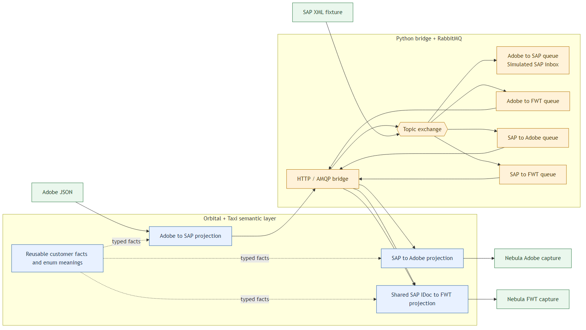
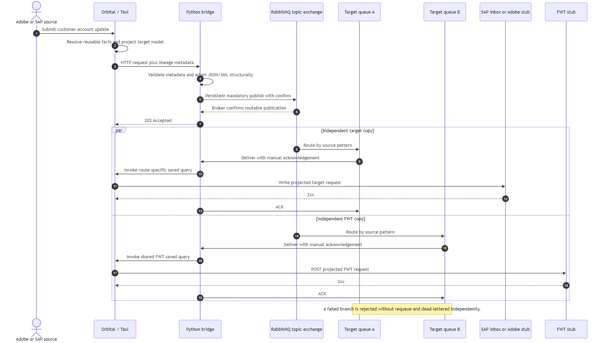

<!-- COVER -->

# Orbital Customer Account Integration POC

## A case study in semantic integration with Taxi

Adobe, SAP and FWT customer-account updates using Orbital, Taxi, RabbitMQ and a narrow Python transport bridge

**Prepared:** 29 July 2026  
**Document status:** Implementation case study  
**Scope:** Bounded proof of concept; not a production-readiness approval

> **Decision position**  
> The POC proves that reusable Taxi semantics can drive a selected customer-account update slice across three independent wire contracts. It does not yet prove that Orbital and RabbitMQ should replace the current Azure integration platform. The recommended next step is a controlled production-readiness pilot, with the Taxi semantic layer retained as the main demonstrated value and broker replacement assessed separately.

<!-- PAGE BREAK -->

## Contents

1. Executive summary
2. Context and requirement
3. What was implemented
4. Implementation journey
5. Challenges and lessons learned
6. Results and evidence
7. Comparison with the current Azure implementation
8. Architectural implications
9. Recommendation and next steps
10. Production decision gates
11. Transferable lessons
12. Appendices

## How to read this case study

This document is a decision-oriented companion to the repository README. The README is the engineering reference and runbook; this document concentrates on why the POC was undertaken, what was learned, and what those findings mean for a possible migration from the current BIP implementation.

The comparison is deliberately bounded. “Azure” means the customer-account implementation inspected in the local `bip` repository: Logic Apps, Azure Service Bus subscriptions, Azure Functions/C# mappings, SAP connectivity and target clients. “Orbital” means the runtime and design exercised by this POC, including its RabbitMQ and Python bridge scaffolding. It is not a comparison of every capability available in either product family.

Evidence comes from the checked-in implementation, synthetic fixtures, component tests, validated Compose configurations, Orbital package health and recorded live smoke-test outcomes. No production load, resilience, security, commercial or total-cost benchmark was performed.

<!-- PAGE BREAK -->

# 1. Executive summary

The requirement was to reproduce a representative customer-account integration outside the current Azure BIP estate. Adobe-origin updates had to reach a simulated SAP boundary; SAP-origin updates had to return to Adobe; and the design then had to extend to FWT. RabbitMQ was used to represent topic/subscription behaviour and the SAP boundary, while Taxi was expected to provide reusable, strongly typed business definitions rather than another canonical physical customer payload.

The POC achieved the bounded functional objective. It implemented four delivery branches:

- Adobe to SAP;
- Adobe to FWT;
- SAP to Adobe; and
- SAP to FWT.

Eleven Taxi source files define shared facts, system-owned contracts, projections, saved queries and target services. RabbitMQ provides one topic exchange, four business queues, four dead-letter queues and eight explicit bindings. One Python image runs in three configured roles to bridge HTTP and AMQP, enforce transport metadata and adapt XML/JSON structure. Nebula supplies disposable Adobe and FWT HTTP targets. The recorded verification state was 41 passing bridge tests and an Orbital package with 11 healthy sources, zero warnings and zero errors.

The most important positive result was semantic reuse. Adobe, SAP and FWT were allowed to keep their own payload shapes and code systems. Taxi linked them through narrow business meanings such as customer status, account type, contact preference, address fields and identifiers. Adding FWT reused those meanings instead of introducing a second independent C#-style mapping table.

The most important negative result was runtime and transport maturity in the tested configuration. A bespoke bridge was required because the deployed workspace did not have a supported RabbitMQ/AMQP Taxi connector configured. Two Orbital 0.38 behaviours also required workarounds: outbound `@Xml` serialization through the HTTP write path and concurrent XML parsing during fan-out. The POC therefore has more operational components than the semantic model alone suggests.

The comparison is not a simple winner/loser outcome:

- **Orbital/Taxi was better for expressing and extending semantic mapping intent.** Typed facts, enum synonyms and independent contracts made the selected transformations easier to reason about and reuse.
- **The current Azure implementation remains better established for production transport and operations.** It uses managed Service Bus, Logic App workflows, existing SAP connectivity and established Azure/.NET support patterns. The POC lacks automated retry/backoff, idempotency, replay, HA, production security and operational service ownership.
- **The strongest next move is a hybrid or controlled route pilot.** Preserve the Taxi taxonomy and projections, then prove them with the existing Azure transport/connectivity or a supported native connector before making a separate broker/platform replacement decision.

<!-- PAGE BREAK -->

## POC at a glance

| Measure | Implemented result |
|---|---|
| Systems represented | Adobe, SAP and FWT |
| Delivery branches | Adobe→SAP, Adobe→FWT, SAP→Adobe, SAP→FWT |
| Taxi sources | 11 |
| Saved-query endpoints | 3 |
| RabbitMQ business queues | 4 |
| Route-specific DLQs | 4 |
| Explicit RabbitMQ bindings | 8 |
| Bridge deployments | 3 roles from one image |
| Automated bridge tests | 41 passing |
| Orbital package result | Healthy; 0 warnings; 0 errors |
| Real external systems | None; all fixtures/endpoints are synthetic or simulated |
| Production readiness | Not demonstrated |

# 2. Context and requirement

## 2.1 The current integration context

The existing BIP implementation distributes customer-account responsibilities across several Azure resources and .NET components. Logic Apps act as on-ramps and off-ramps. Azure Service Bus provides a `customeraccount` topic and target subscriptions, with deployment rules based on metadata such as `SystemOrigin`. Azure Functions and C# services implement mapping and target-client behaviour. Configured SAP connections and an on-premises gateway provide the SAP boundary. Separate logic supports Adobe and FWT delivery.

The inspected Adobe on-ramp generates a message ID, returns HTTP `202`, archives the ingress, records workflow correlation, invokes an Adobe customer-account Function and publishes IDoc-shaped JSON to Service Bus with origin metadata. Its response is linked to message-ID creation rather than completion of mapping or topic publication. The SAP off-ramp consumes the SAP subscription, normalises the broader IDoc model, serialises it to XML and calls the SAP connector. The SAP gateway/on-ramp accepts SAP XML, passes through a Service Bus queue and republishes an IDoc-shaped JSON event with `SystemOrigin=sap`. Adobe and FWT off-ramps then use their own Functions and HTTP clients.

This estate has important strengths: it is already shaped around production Azure operations, uses established team technologies, and includes workflow history, correlation, payload archival and failure-notification patterns in the inspected templates. Its Adobe client uses OAuth, while SAP uses configured connector resources. Its trade-off is that business meaning and transformation intent can be distributed across Logic App JSON, C# schemas, mapper classes, reference-data services, client services, subscription configuration and infrastructure scripts. Understanding a single field often requires following it through multiple technologies and repositories.

The Azure mapping surface is also substantially broader than the POC. It includes create and update handling, additional IDoc segments, bank and partner data, reference-data lookups, balances, timestamps and a much larger FWT contract. The POC therefore tests an alternative modelling approach on a selected slice; it does not reproduce the full current contract.

The POC was not started simply to exchange one more payload. It tested a different proposition: whether customer facts could be defined once by business meaning and reused across independent system contracts, while still supporting asynchronous, source-aware routing.

## 2.2 Requirement tested

The requested implementation had five practical objectives:

1. Recreate Adobe-origin customer-account updates to SAP.
2. Recreate SAP-origin customer-account updates back to Adobe.
3. Represent SAP and subscription behaviour with RabbitMQ rather than a live SAP or Azure Service Bus connection.
4. Extend both origins to FWT using two new FWT business queues.
5. Use reusable Taxi data definitions without forcing Adobe, SAP and FWT to adopt one shared physical customer object.

The implementation also needed to be runnable in the existing Docker-based Orbital workspace and clear enough for another engineer to deploy, smoke-test and continue.

## 2.3 Deliberate boundaries

The POC covers updates only. Adobe create flows and SAP `MSGFN=009` are not implemented. SAP is represented by a retained queue plus a manually injected SAP XML fixture; the simulated SAP inbox does not automatically echo a response. Adobe and FWT are Nebula stubs. Only a deterministic first FWT field slice is implemented.

The following were deliberately not claimed: complete BIP parity, real credentials or endpoints, exactly-once delivery, production retry/replay, durable idempotency, ordering, HA, TLS, least-privilege security, disaster recovery, performance, production supportability or cost advantage.

## 2.4 Success criteria

The POC would be considered functionally successful if it could demonstrate all of the following for synthetic fixtures:

- Taxi compiles the reusable facts and three system contracts without warnings or errors.
- Adobe JSON projects into a semantically correct SAP IDoc XML payload.
- One Adobe publish creates independent SAP-inbox and FWT delivery states.
- One SAP publish creates independent Adobe and FWT delivery states.
- The final Adobe and FWT HTTP bodies match their expected fixtures.
- Lineage and origin metadata survive HTTP/AMQP boundaries.
- Consumers acknowledge only after successful downstream completion and dead-letter failed copies independently.
- No FWT-origin route or accidental source echo is introduced.

# 3. What was implemented

## 3.1 End-to-end architecture

**Figure 1 — Implemented POC architecture.** Blue components own semantic projection; amber components own transport and delivery; green components represent sources or simulated targets.

An Adobe request enters Orbital as JSON. Taxi extracts reusable facts from the Adobe-owned contract and constructs a SAP IDoc parameter model. Orbital calls the bridge over HTTP. The bridge validates transport metadata, serializes the already-projected structure as XML and performs a persistent, mandatory RabbitMQ publish with publisher confirmation.

RabbitMQ fans the Adobe event out to an unconsumed simulated SAP inbox and an Adobe-to-FWT queue. The FWT worker consumes its independent copy, structurally converts XML to equivalent JSON, and calls the shared Orbital FWT query. Taxi constructs the FWT-owned request and Nebula captures the final POST.

A SAP-origin test begins with a persistent SAP XML message. RabbitMQ creates independent SAP-to-Adobe and SAP-to-FWT copies. The Adobe worker sends raw XML to Orbital, where Taxi constructs the Adobe write request. The FWT worker uses the same FWT path as the Adobe-origin branch. Each route has independent acknowledgement and dead-letter state.

## 3.2 Route model

| Origin | RabbitMQ route | Consumer | Final outcome |
|---|---|---|---|
| Adobe | `customer-account.adobe.updated` → `poc.customer-account.adobe-to-sap` | None | Durable simulated SAP inbox copy remains available for inspection |
| Adobe | `customer-account.adobe.updated` → `poc.customer-account.adobe-to-fwt` | Adobe-to-FWT worker | Taxi projects and Nebula captures the FWT POST |
| SAP | `customer-account.sap.updated` → `poc.customer-account.sap-to-adobe` | Main bridge worker | Taxi projects and Nebula captures the Adobe PUT |
| SAP | `customer-account.sap.updated` → `poc.customer-account.sap-to-fwt` | SAP-to-FWT worker | Taxi projects and Nebula captures the FWT POST |

Positive topic bindings route only approved origins. No `customer-account.fwt.*` binding exists. This prevents a transport echo in the POC; it is not a complete production loop-prevention or idempotency policy.

This is intentionally not the same topology or broker wire contract as BIP. The inspected Azure design uses target-oriented subscriptions and publishes IDoc-shaped JSON to Service Bus. The POC uses origin-to-target queues and always carries SAP XML in RabbitMQ. Splitting FWT into Adobe-origin and SAP-origin queues makes each edge's failure state visible, but it also increases topology and changes operational semantics.

## 3.3 The semantic model

The POC separates three concerns:

- **System contracts** describe the physical Adobe JSON, SAP IDoc and FWT JSON shapes.
- **Reusable Taxi facts** describe business meaning, such as `CustomerFirstName`, `SapCustomerNumber`, `CustomerAccountStatus` and `ContactPreference`.
- **Queries and services** state which target contract must be constructed and which operation must be called.

This avoids a common failure mode in integration models: treating every string as interchangeable. `AdobeCustomerId` and `SapCustomerNumber`, for example, are deliberately different types even though both are strings on the wire. A reverse Adobe write therefore requires an explicit Adobe cross-reference; Taxi cannot silently substitute the SAP account number.

That identity policy differs from the inspected BIP implementation, which currently uses SAP `KUNNR` in the Adobe write path and converts it through integer parsing in parts of the body mapping. The POC preserves the leading-zero SAP number and requires a separate Adobe ID. This is a deliberate design experiment, not exact reverse-payload parity; the shared synthetic values can conceal the difference unless identity cases are tested explicitly.

Enum synonyms connect system codes to shared meaning. An Adobe status such as `ACTIVE`, a SAP `KATR5` code such as `AC`, and the FWT status `ACTIVE` can represent the same semantic status without forcing a common wire enum. Similar treatment is used for account type, account group, contact preference and action.

| Business fact | Adobe representation | SAP representation | FWT representation | POC rule |
|---|---|---|---|---|
| SAP account identity | Custom attribute `sap_unique_id` | `ZBP_CBO/KUNNR` | `id` and `addressDetails.id` | Preserve as a string, including leading zeroes |
| Adobe identity | Top-level Adobe `id` | Not carried as `KUNNR` | Not required | Supply explicit cross-reference for SAP→Adobe |
| Status | Adobe custom string | `KATR5` code | FWT status string | Resolve through shared enum meaning |
| Contact preference | Separate email/post flags | One `KATR10` code | Separate booleans | Combine to a fact, then expand per target |
| Date of birth | `yyyyMMdd` | `RGDATE` as `yyyyMMdd` | `yyyy-MM-dd` | Apply deterministic formatting only |
| Name and address | Nested Adobe JSON | IDoc segments | Nested FWT structures | Retain distinct field meanings and target ownership |

## 3.4 Why the Python bridge exists

The bridge is a transport adapter, not a second mapping engine. The deployed Orbital workspace provides HTTP service connectivity but did not have a supported RabbitMQ/AMQP Taxi connector configured with the required publisher-confirm, metadata, acknowledgement and dead-letter behaviour.

On publish, the bridge validates UUID lineage, origin, action, schema and event metadata; emits canonical SAP XML from the Taxi-projected parameter object; and returns HTTP `202` only after RabbitMQ confirms a routable publish. On consume, it uses `prefetch=1` and manual acknowledgements, validates the message envelope, calls the appropriate Orbital saved query, and acknowledges only after a 2xx result. Validation, conversion or downstream failures are rejected without requeue so RabbitMQ can dead-letter that route copy.

Keeping customer mapping out of Python was an explicit boundary. If a supported native connector becomes available in the deployed edition, the bridge should be replaceable without redesigning the Taxi contracts.

## 3.5 Why RabbitMQ and Nebula exist

RabbitMQ gives the POC a visible asynchronous delivery model. It represents Azure Service Bus-like topic/subscription fan-out and a durable simulated SAP inbox, while allowing publisher confirms, independent acknowledgements and route-specific dead letters to be exercised locally.

Nebula is service virtualization only. It exposes an Adobe customer PUT and an FWT customer-account POST, logs exact request bodies and returns deterministic responses. It proves that Orbital completed a target projection and call without external credentials or side effects. It does not validate payloads, persist customers or model production target behaviour.

## 3.6 Delivery sequence

**Figure 2 — Generic delivery sequence.** The caller’s synchronous success proves confirmed publication, not asynchronous completion of every target branch.

The distinction between publication and completion is important. The HTTP `202` response means RabbitMQ accepted a routable persistent message. The FWT or Adobe outcome must be established separately using queue state, worker health, dead-letter state and the corresponding Nebula capture.

This response contract is also different from the inspected Adobe Logic App. In the POC, the Adobe ingress response follows Taxi projection and broker confirmation. In BIP, the on-ramp can return its message-ID response before mapping and Service Bus publication. Neither should be described as equivalent without an explicit API-semantics decision.

# 4. Implementation journey

## 4.1 Establish the Adobe-to-SAP semantic slice

The first stage modelled the Adobe fixture and the required subset of the SAP `ZBUPA_CBO` IDoc. Adobe arrays and custom attributes were exposed as typed facts using Taxi expressions and JSON-path extraction. A closed SAP parameter model then made the required outbound structure explicit.

This stage demonstrated that semantic reuse does not require a universal physical customer DTO. The source remains recognisably Adobe; the target remains recognisably SAP; Taxi provides the bridge in meaning.

## 4.2 Add SAP-to-Adobe and asynchronous transport

RabbitMQ was introduced as the topic/subscription and simulated SAP boundary. The bridge supplied the missing AMQP protocol behaviour. The SAP XML ingress model and Adobe target contract then allowed the return flow to be projected in Orbital.

This stage surfaced the identity issue that a structural mapping can easily hide: a SAP number is not an Adobe customer ID. The POC therefore carries `X-Adobe-Customer-Id` explicitly for the reverse route rather than inferring it from `KUNNR`.

## 4.3 Clean the Taxi model

Early contracts generated warnings where domain definitions were too close to primitive types or semantically similar fields could be confused. The model was refactored into narrow scalar facts, shared enum meanings and system-owned wire enums. The resulting Orbital package compiled with zero warnings and zero errors.

The cleanup was not cosmetic. It made erroneous substitutions harder and improved the reuse surface needed for FWT.

## 4.4 Extend the model to FWT

FWT was added as an outbound-only target for both Adobe and SAP origins. Two new business queues gave the routes independent delivery state; each also received a supporting DLQ. Both workers call one shared `to-fwt` query because the Rabbit body is the same SAP IDoc-shaped content.

The FWT contract deliberately includes only values with an authoritative and deterministic source. Display name, date formatting and contact-preference booleans are derived in Taxi. Timestamps, balances, currency, bank details, reference descriptions and other unsupported properties are not invented merely to fill a target schema.

The current Azure FWT mapper populates a much broader model, including timestamps, credit/balance information, bank and account-manager data, reference descriptions, flags, standing instructions and additional properties. The POC result demonstrates reuse for its first slice only; it does not establish FWT contract parity or reproduce every origin-specific Azure behaviour.

## 4.5 Make the POC operable

The final stage added strict metadata validation, health endpoints, confirms, acknowledgements, dead-lettering, Docker service roles, fixtures, tests, smoke-test instructions and deployment guidance for the existing Git-workspace Orbital installation.

This stage revealed that implementation source and runtime topology are separate deployment concerns. Pushing `orbital-poc` updates the managed project checkout, but it does not automatically merge RabbitMQ definitions or Compose services in the companion Orbital runtime folder.

# 5. Challenges and lessons learned

## 5.1 Summary of challenges

| Challenge | Observed symptom | Implemented response | Main lesson |
|---|---|---|---|
| Weak primitive modelling | Taxi warnings and risk of similarly shaped values being substituted | Narrow semantic facts, distinct identities and enum synonyms | Reuse business meaning, not primitive compatibility |
| Missing AMQP boundary | Orbital queries could not perform required RabbitMQ lifecycle directly in this workspace | Small FastAPI/Pika bridge | Keep protocol code replaceable and free of business mapping |
| Outbound XML serialization | `@Xml` input worked but the HTTP write path could not serialize the model | Plain publish model plus structural JSON→XML adapter | Projection and serialization are different responsibilities |
| Concurrent XML parsing | Parallel fan-out produced `FWK005: parse may not be called while parsing` | Raw XML for Adobe; equivalent JSON for FWT | Exercise concurrency, not just one route at a time |
| Cross-system identity | SAP number could be mistaken for Adobe ID | Explicit Adobe cross-reference metadata | Identity resolution is a domain capability, not a cast |
| Apparently empty queues | Successful active routes often showed zero ready messages | Correlate worker, DLQ and target-capture evidence | Queue depth is not an outcome assertion |
| Idle publisher connection | First request after a long idle period could return 503 | Close failed connection; next call reconnects | Retry is unsafe until idempotency and uncertain outcomes are addressed |
| Split deployment | Git push did not add queues/workers to the running instance | Coordinate repo deployment with external Compose/definitions merge | Source and runtime topology need one release contract |
| Fan-out duplication | Adobe update and later SAP confirmation can both reach FWT | Documented; business policy remains open | Transport fan-out can create duplicate business effects without forming a loop |

## 5.2 Semantic definitions require discipline

Taxi is most useful when types are narrow enough to express meaning. A taxonomy made only of aliases for primitive strings would add ceremony without protecting the mapping. The cleanup showed that identifiers, address lines, telephone numbers, booleans and lineage IDs need distinct facts when substitution would be harmful.

The practical learning is to start from business ambiguity, not field similarity. Two fields should share a type only when either is a valid source for the other. Compiler warnings are valuable design feedback and should be removed before adding more target contracts.

## 5.3 XML exposed two separate runtime limitations

The first issue was outbound serialization. In the tested Orbital 0.38 path, an `@Xml` model could be deserialized but the HTTP request factory could not serialize it through the raw-object overload used by the write operation. The workaround was to let Taxi construct a structurally identical plain parameter model and let Python emit elements and known attributes. Business values remain owned by Taxi.

The second issue appeared only under fan-out. When SAP-to-Adobe and SAP-to-FWT parsed XML concurrently, the runtime produced `FWK005: parse may not be called while parsing`. The FWT workers now adapt XML to a structurally equivalent JSON envelope before invoking Orbital, while SAP-to-Adobe retains the raw XML path.

These are observations in the tested version and configuration, not universal product claims. They nevertheless matter to a migration decision because workarounds create code, tests and operational ownership that the current Azure path does not require in the same form.

## 5.4 A bridge can stay narrow—but it is still a component

The bridge design successfully kept status, name, address, preference and target-shape mapping out of Python. That is an architectural success. However, a narrow adapter still needs an image, dependencies, configuration, lifecycle, health, reconnect behaviour, tests, upgrades and on-call ownership.

The POC also exposed an uncertain-publish scenario after idle connections. Automatically retrying a failed publish could duplicate a message if the broker accepted it but the client lost the confirmation. The correct production response is not a blind retry; it is a designed idempotency key, a delivery contract and explicit handling of uncertain outcomes.

## 5.5 Asynchronous success requires correlated evidence

The initial “queue is empty” observation was not a failure. Active workers can consume and acknowledge faster than a person can inspect the RabbitMQ UI. The meaningful evidence chain is:

1. publisher confirmation and matching route;
2. queue consumer and ready/unacknowledged state;
3. worker health and correlated logs;
4. target capture; and
5. absence of a route DLQ message.

The unconsumed Adobe-to-SAP queue is intentionally different: its retained message represents the simulated SAP inbox and should remain ready until inspected or removed.

The live smoke tests currently poll for fixture-identifying captures and queue state, but exact end-to-end body comparison remains partly manual. A production-readiness pilot should automate golden-master comparison and include lineage IDs in target captures so concurrent tests cannot match the wrong request.

## 5.6 Fan-out is not a loop, but can still duplicate effects

Positive source bindings prevent an Adobe message from being routed back into an Adobe-origin queue and no FWT-origin binding exists. That is sufficient for the POC’s transport topology.

It does not answer a business question: if an Adobe update reaches FWT and a later SAP confirmation of the same account also reaches FWT, should FWT see two writes or one? The two deliveries are legitimate independent events, not an infinite loop, but they may represent one business change. A business key, version, causation relationship and deduplication policy are required before production use.

## 5.7 Deployment spans two versioned surfaces

The Git repository contains Taxi, bridge and Nebula source. The running Orbital installation also has external Compose files and RabbitMQ definitions. Definitions import merges desired objects but does not necessarily prune stale broker objects. Compose readiness can show containers running before the Taxi package and consumers are ready.

The operational lesson is to package these as one coordinated release with explicit ordering: update application source, merge and validate topology, keep consumers stopped during destructive/recreation windows, wait for the Orbital package to become healthy, then start consumers and verify bindings. A Git push alone is not a deployment of the complete POC.

# 6. Results and evidence

## 6.1 What the POC proved

| Claim | Evidence | Assessment |
|---|---|---|
| Reusable semantics can span three wire contracts | Shared Taxi facts/enums drive Adobe, SAP and FWT projections | **Proven for selected field slice** |
| Adobe-origin update reaches simulated SAP | Expected SAP XML is published to retained SAP queue | **Proven with synthetic fixture** |
| Adobe-origin update reaches FWT independently | Separate queue is acknowledged and expected FWT body captured | **Proven with synthetic fixture** |
| SAP-origin update reaches Adobe and FWT independently | Two queue copies are acknowledged and both expected bodies captured | **Proven with synthetic fixture** |
| Basic at-least-once mechanics are explicit | Persistent publish, confirms, manual ACK and reject/no-requeue DLQ paths | **Component behaviour proven; full resilience not proven** |
| Taxi package quality | 11 sources, healthy package, zero warnings and errors | **Proven in tested workspace** |
| Bridge component quality | 41 tests, Ruff and byte compilation successful | **Proven at component level** |
| Production replacement viability | Real systems, full mappings, security, scale, HA and recovery untested | **Not proven** |

## 6.2 Payload outcomes

The Adobe fixture preserved the SAP customer number, including leading zeroes, selected the default billing address, translated status and preference codes, and produced a SAP XML document that semantically matched the POC's expected fixture.

The SAP fixture produced the POC's expected nested Adobe update, using the explicit Adobe cross-reference rather than the SAP number. Both origin paths produced the expected deterministic FWT first-slice body, including account status/action/type/group, nested address, formatted date of birth and derived email/post preference booleans. These are golden outputs for this POC, not proof that every field and edge-case behaviour matches BIP.

The two FWT branches reuse the same target query but retain independent RabbitMQ delivery state. This is a useful proof of semantic and projection reuse. It is not yet proof that the full production FWT schema can be sourced from the chosen event contract.

## 6.3 Evidence limitations

The 41 tests are bridge/component tests using fakes and HTTP mocks. Full broker-to-Orbital exact fixture assertions remain manual. Nebula captures request bodies but is not a contract-testing service. A `202` confirms routable publication, not every downstream branch. Durable queues and persistent messages do not establish exactly-once delivery, HA or zero data loss.

No load test, soak test, failover exercise, security assessment, cost model or production comparison run was performed. Those gaps should remain visible when this case study is used in an architecture decision.

# 7. Comparison with the current Azure implementation

## 7.1 Summary comparison

| Dimension | Advantage demonstrated by Orbital/Taxi POC | Azure advantage or unresolved POC gap |
|---|---|---|
| Semantic modelling | Narrow facts, enum synonyms and independent contracts make business meaning explicit and compiler-checkable | Existing C# ecosystem is mature, familiar and covers a broader production field/behaviour set |
| Adding a target | FWT reused existing facts and one shared query rather than another independent mapper | Azure has established Logic App/Function deployment patterns and a much larger managed connector ecosystem |
| Mapping visibility | Transformation intent is concentrated near contracts and queries | Existing BIP logic is distributed, but also benefits from standard debugging, profiling and IDE support |
| Messaging | Rabbit topology makes per-edge queues, ACKs and DLQs explicit and easy to inspect locally | Azure Service Bus is managed and already integrated with Logic Apps, target subscriptions, rules and Azure operations; topology and wire contract are not equivalent |
| SAP connectivity | Rabbit queue allows safe local testing with no SAP dependency | Current Azure estate has a real SAP connector/gateway path; the POC has only a simulated inbox/manual producer |
| Reliability | Confirms, persistent messages, manual ACK and route DLQs establish a sound minimum pattern | POC lacks retry/backoff, durable idempotency, replay, ordering, HA and DR; current estate has established operational workflows |
| Local development | Docker, fixtures, RabbitMQ UI and Nebula provide a fast deterministic loop | Local stack introduces Orbital, RabbitMQ, Python and Compose skills; production parity remains incomplete |
| Observability | Lineage metadata and explicit route state make transport behaviour inspectable | Inspected Azure templates include Logic App run history, workflow IDs, archive/log and QC failure-notification patterns; POC evidence still relies partly on manual log correlation |
| Security | Safe synthetic environment avoids real credentials and side effects | POC deliberately lacks TLS, managed secrets, least privilege, PII controls and production network design |
| Deployment | Taxi project is compact and contract-centred | POC source and runtime topology are split; Azure deployment patterns are already integrated into the BIP estate |
| Runtime maturity | Compiler feedback and model-first iteration were productive | Tested Orbital version required XML and AMQP workarounds; support and upgrade ownership are not established |
| Portability | System contracts are less coupled to one physical canonical DTO | Orbital is itself a runtime dependency; RabbitMQ/bridge adds ownership. “No lock-in” was not demonstrated |
| Cost and performance | No valid conclusion | No benchmark or TCO study was performed; neither cheaper nor faster can be claimed |

## 7.2 What was better in the Orbital POC

### Business meaning was more explicit

The clearest improvement was the ability to state that different wire fields mean the same thing while retaining different contracts. Code systems were connected through enum synonyms, and ambiguous primitive values were separated by semantic types. This made incorrect substitutions visible earlier.

### Extension to FWT reused the semantic layer

FWT could consume the existing account, status, preference, person and address meanings. The target model expressed FWT’s own nested JSON shape, while deterministic derivations remained in Taxi. That is a stronger reuse mechanism than copying an existing mapper and editing it for a new target.

### Local experimentation was fast and safe

RabbitMQ, fixtures and Nebula allowed the entire local integration path to be exercised without Azure, SAP, Adobe or FWT credentials. A developer could see routing, acknowledgements, dead letters and exact target requests with no external side effects.

### Contract boundaries were easier to discuss

Taxi made system ownership and semantic ownership explicit. The model could clearly state why the Adobe ID and SAP number are different, which values are authoritative, and which target fields cannot yet be populated. This is useful beyond code generation: it supports architecture and domain review.

## 7.3 What was worse or less mature than the current Azure implementation

### Production transport required bespoke code

The tested Orbital setup needed a Python AMQP bridge. Azure Service Bus and SAP integrations are already supported by the current estate’s managed connectors and workflows. The bridge is small, but it expands the service catalogue and support surface.

### Runtime workarounds affected the design

Outbound XML serialization and concurrent XML parsing forced separate input/publish models and an XML-to-JSON adaptation for FWT. These workarounds are contained, but they are additional complexity and upgrade risk.

### Operational controls are incomplete

The POC has a credible base—confirms, persistence, manual ACK and dead letters—but not a production delivery policy. It does not yet provide retry/backoff, replay tooling, idempotency, ordering, high availability, backup/restore, disaster recovery or a defined SLO.

### Security and service ownership were out of scope

The POC uses development credentials and local Docker networking. It has no approved secret-management, TLS/mTLS, least-privilege, retention, audit or PII-log-redaction design. It also adds Taxi/Orbital, RabbitMQ and Python skills to a team currently operating Azure/.NET patterns.

### Functional coverage is narrower

The current Azure codebase represents a broader operational implementation. It handles create and update paths, fuller SAP segments, reference data and a much larger FWT model. The POC is update-only, uses a first FWT slice, has a manual SAP producer and uses a header as an Adobe identity cross-reference. Business parity cannot be inferred from the successful fixture.

## 7.4 Important nuance about Azure reliability

The comparison should use the actual BIP implementation rather than generic platform marketing. For example, inspected Adobe and FWT Function actions explicitly disable action retry. Conversely, the Azure templates show real workflow, Service Bus, archival/correlation and notification patterns that the POC has not recreated. Service Bus entity settlement, max-delivery and live connector policies were not verified from deployed state. A future assessment should compare route-by-route effective behaviour—retry, settlement, dead-letter, replay, monitoring and recovery—not simply list platform features.

# 8. Architectural implications

## 8.1 The SAP IDoc is becoming a de facto event contract

The POC correctly avoids one universal customer DTO in Taxi. However, both FWT queues carry SAP IDoc XML, and the Adobe-to-FWT path first projects Adobe into SAP shape. Operationally, this makes the SAP IDoc a de facto intermediate event contract.

That choice simplified the POC and proved reuse, but it has consequences:

- a FWT-only fact that has no SAP field cannot survive the Adobe→SAP-IDoc→FWT route;
- changes to the SAP schema can affect FWT even when FWT has no SAP dependency;
- the event may inherit SAP-specific control structures that are irrelevant to other targets; and
- semantic independence at compile time does not remove physical coupling at runtime.

A production design must choose deliberately among three patterns:

1. Keep the SAP IDoc as the integration event and accept/document that coupling.
2. Publish a neutral, versioned customer event envelope for fan-out.
3. Let source-specific Orbital queries expose shared Taxi facts directly to each target, without first materialising SAP shape.

This decision should be driven by authoritative data ownership and evolution needs, not by whichever payload was easiest to reuse in the POC.

## 8.2 Broker replacement is a separate decision

Taxi’s semantic value does not depend on replacing Azure Service Bus with RabbitMQ. Combining both changes in one migration would mix the proof of a better modelling approach with a broker, operations and support-model decision.

The next experiment should therefore isolate them. Either connect the Taxi/Orbital layer to existing Azure messaging/connectivity, or prove a supported native connector with production-grade delivery semantics. RabbitMQ should become the production broker only if it is already strategic or an independent operational and TCO case supports it.

## 8.3 The POC establishes at-least-once ingredients, not a complete contract

Publisher confirms and manual acknowledgements are necessary but insufficient. A production design must specify an idempotency key, duplicate handling, uncertain publish outcomes, retry classes, maximum attempts, poison-message policy, replay, ordering and reconciliation. “Exactly once” should not be used unless the end-to-end business effect—not just broker delivery—is proven.

# 9. Recommendation and next steps

## 9.1 Recommended position

Proceed to a controlled production-readiness pilot; do not approve a wholesale platform replacement from this POC alone.

Preserve and extend the Taxi taxonomy, system contracts and projection tests because they are the clearest demonstrated improvement. Treat the broker and connector choice as a separate architecture decision. The lowest-risk next experiment is a hybrid spike: use Orbital/Taxi for semantic projection while retaining current Azure Service Bus and SAP connectivity, or use a supported native connector that meets the required acknowledgement and metadata contract.

## 9.2 Options

| Option | Benefit | Main drawback | Position |
|---|---|---|---|
| Retain current Azure implementation unchanged | Lowest migration risk; existing operational model | Does not capture the semantic-modelling improvement | Viable baseline |
| Hybrid: Taxi/Orbital semantics with Azure transport/connectors | Tests the strongest POC result while preserving mature connectivity | Requires supported integration between the layers | **Recommended next experiment** |
| Route-by-route Orbital/RabbitMQ adoption | Limits blast radius and creates production evidence | Operates two platforms during transition | Possible after decision gates |
| Full Orbital/RabbitMQ replacement | Maximum architectural change and potential consolidation | Highest reliability, security, skills and migration risk; not evidenced | Not recommended yet |

## 9.3 Phased path

1. **Contract parity and golden masters.** Approve a complete route/field matrix and automate exact comparison against representative BIP payloads and edge cases.
2. **Connector spike.** Prove Azure Service Bus or a supported native AMQP connector, and retest XML behaviour on a pinned Orbital release.
3. **Reliability engineering.** Add idempotency, retry/backoff, replay, poison handling, ordering policy, correlation and failure recovery.
4. **Non-production shadow run.** Consume representative events with side effects suppressed, compare outputs and produce reconciliation reports.
5. **Canary route.** Select one bounded, reversible route with clear SLOs, ownership and rollback.
6. **Platform decision.** Use operational evidence, security review and three-year TCO to decide whether to expand, remain hybrid or stop.

# 10. Production decision gates

The following gates should be measurable and signed off before a production migration:

1. **Business parity:** approved Adobe↔SAP/FWT field matrix; create/update/skip rules; enum, null, date and reference-data cases; full required FWT slice; domain-owner approval.
2. **Identity and event semantics:** authoritative Adobe↔SAP identity service or store; versioned event contract; required origins; policy for Adobe update plus later SAP confirmation.
3. **Golden-master evidence:** automated comparison with representative current BIP payloads for every route and edge case, with no unexplained deltas.
4. **Connector and runtime:** pinned, supported Orbital release; XML limitations resolved or workarounds formally owned; native connector or bridge owner, upgrade policy and SLO.
5. **Delivery semantics:** explicit at-least-once contract; durable idempotency; retry/backoff and limits; poison handling; DLQ replay; ordering policy; restart tests showing no loss and controlled duplicates.
6. **Scale and resilience:** agreed throughput, latency and payload limits; peak/soak testing; broker and Orbital failover; RTO/RPO; backup/restore and disaster-recovery exercise.
7. **Security and compliance:** TLS/mTLS, managed secrets and rotation, least privilege, network controls, PII redaction, encryption, retention and audit approval.
8. **Observability and operations:** end-to-end lineage, dashboards and alerts, payload-safe diagnostics, runbooks, on-call rota and named service ownership.
9. **Migration controls:** shadow/dual run, reconciliation, canary, rollback and cutover criteria.
10. **Commercial and people case:** three-year TCO including licences, infrastructure, engineering/on-call and training; vendor support/roadmap; accountable team.

# 11. Transferable lessons

1. **Model identities before mappings.** A string that identifies a SAP account is not automatically valid as an Adobe identity.
2. **Use semantic types only when they protect meaning.** Excessive primitive inheritance produces warnings and weak reuse; narrow facts make the compiler useful.
3. **Keep wire contracts system-owned.** Reuse meaning across contracts rather than forcing every system into one physical DTO.
4. **Do not let a protocol adapter become a mapper.** Structural serialization and metadata validation can live in the bridge; customer rules should remain in Taxi.
5. **Test fan-out concurrently.** Sequential happy paths did not reveal the XML parser issue.
6. **Treat queue depth as transient telemetry.** Assert downstream effect and lineage, not whether an active queue happens to contain a message.
7. **Separate publish acceptance from business completion.** HTTP `202` and broker confirmation are not proof that all subscribers succeeded.
8. **Design duplicates before retries.** At-least-once delivery, uncertain publishes and source confirmations require business idempotency.
9. **Version source and topology together.** Queries, workers, definitions and Compose services form one release even when stored in different locations.
10. **Do not confuse a semantic-layer success with a platform-replacement proof.** They are different decisions and should be tested independently.

<!-- PAGE BREAK -->

# Appendix A — Implemented technical inventory

## A.1 Orbital endpoints

| Endpoint | Input | Purpose |
|---|---|---|
| `POST /api/q/customer-account/from-adobe` | Adobe JSON plus lineage/origin/action headers | Project Adobe facts to SAP publish model and call the bridge |
| `POST /api/q/customer-account/from-sap` | Raw SAP XML plus lineage and explicit Adobe ID | Project SAP facts into Adobe write request |
| `POST /api/q/customer-account/to-fwt` | Structurally equivalent IDoc JSON plus lineage headers | Project shared SAP facts into FWT write request |

## A.2 Runtime components

| Component | Count/role |
|---|---|
| Orbital/Taxi | Compiles 11 sources and hosts three saved queries |
| Python bridge image | One image; three configured service roles |
| RabbitMQ | One event exchange, one DLX, four main queues, four DLQs, eight explicit bindings |
| Nebula | One service containing Adobe PUT and FWT POST stubs |
| Synthetic fixtures | Adobe input, SAP input, expected SAP XML, expected Adobe JSON, expected FWT JSON and AMQP metadata |

## A.3 Known functional gaps

- Update-only; create is not implemented.
- `KTOKD != 1` needs an explicit handled-skip outcome.
- Adobe identity uses a POC header rather than an authoritative cross-reference service.
- Full FWT canonical-account parity is not implemented.
- Real SAP, Adobe, FWT, Azure Service Bus and reference-data connections are absent.
- No FWT-origin customer-account route exists.
- The simulated SAP inbox does not emit a response automatically.

## A.4 Known delivery and operational gaps

- No automated retry/backoff or delayed retry queues.
- No durable idempotency/deduplication store.
- No replay workflow or reconciliation service.
- No ordering, HA, backup/restore or DR proof.
- No production TLS, authentication, secret rotation or least-privilege design.
- No production observability dashboard, alerting or SLO.
- End-to-end exact fixture assertion is not yet fully automated.
- Runtime topology and Git project deployment are separate surfaces.

# Appendix B — Source traceability

The detailed implementation, deployment commands, topology diagrams, file catalogue and troubleshooting guidance are maintained in `orbital-poc/README.md`.

The comparison with the current Azure implementation was grounded in the following BIP files:

- Adobe on-ramp and Service Bus metadata: `bip/la-bip-adobe-customeraccount/LogicApp.json`
- Adobe contract: `bip/bbr.bip.Schema/AccountCreation.cs`
- Adobe on-ramp Function: `bip/bbr.bip.Functions/func-bip-AdobeCustomerAccount.cs`
- Adobe-to-SAP mapping: `bip/bbr.bip.Mapping/MapCreateAccountToIdoc.cs`
- Service Bus subscription/message-type deployment: `bip/bbr.bip.deploy/AddMessageTypes.ps1`
- SAP off-ramp: `bip/la-bip-customeraccount-sap/LogicApp.json`
- SAP off-ramp Function and canonical mapper: `bip/bbr.bip.Functions/func-bip-CustomerAccountSap.cs` and `bip/bbr.bip.Mapping/MapCanonicalCustomerAccount.cs`
- SAP gateway and on-ramp: `bip/la-bip-sap-gateway-customeraccount/LogicApp.json` and `bip/la-bip-sap-customeraccount/LogicApp.json`
- SAP on-ramp Function: `bip/bbr.bip.Functions/func-bip-sapCustomerAccount.cs`
- SAP schema: `bip/bbr.bip.Schema/ZBUPA_CBO.XSD`
- Adobe off-ramp and Function: `bip/la-bip-customeraccount-adobe/LogicApp.json` and `bip/bbr.bip.Functions/func-bip-CustomerAccountAdobe.cs`
- SAP-to-Adobe mapping/filter and target client: `bip/bbr.bip.productservices/ZBUPA_CBOService.cs` and `AdobeDataService.cs`
- FWT off-ramp and contract: `bip/la-bip-customeraccount-fwt/LogicApp.json` and `bip/bbr.bip.Schema/AccountCreationFWT.cs`
- FWT Function: `bip/bbr.bip.Functions/func-bip-CustomerAccountFwt.cs`
- SAP-to-FWT mapping and client: `bip/bbr.bip.productservices/ZBUPA_CBOServiceFwt.cs` and `FineWineDataServices.cs`
- Reference data and cross-cutting archive/logging: `bip/bbr.bip.productservices/ReferenceData.cs` and `bip/bbr.bip.Utilities/LogHelper.cs`

## Evidence classification

| Label | Meaning in this document |
|---|---|
| Proven | Directly observed in code, compiler/test result or recorded live POC outcome |
| Partial | Minimum mechanism demonstrated, but production completeness not tested |
| Not tested | No evidence was gathered; no positive or negative conclusion should be inferred |

# Appendix C — Terms

| Term | Meaning |
|---|---|
| BIP | The current Azure-based integration implementation represented by the local `bip` repository |
| Taxi | The language used to declare semantic types, contracts, queries and services |
| Orbital | The runtime that compiles Taxi, exposes saved queries and executes projections/service calls |
| RabbitMQ | The POC message broker and simulated topic/subscription/SAP boundary |
| Python bridge | Narrow HTTP/AMQP adapter providing transport validation, serialization, publishing and consuming |
| Nebula | Development-only HTTP service virtualization used to capture Adobe and FWT writes |
| System-owned contract | A physical payload shape controlled by Adobe, SAP or FWT rather than a shared canonical DTO |
| Semantic fact | A reusable Taxi type expressing business meaning independently of a system field name |
| DLQ | A route-specific dead-letter queue containing a failed delivery copy |

---

**Case-study conclusion:** The POC is a successful semantic-integration experiment and an incomplete platform-replacement proof. Taxi’s reusable business definitions merit further investment. Production transport, reliability, security and operating-model choices require a separate, evidence-led pilot.
