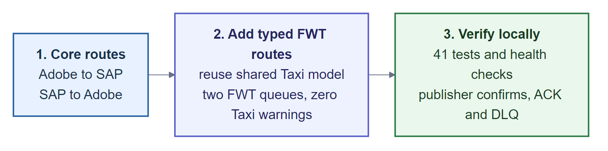

<!-- COVER -->

# Orbital Customer Account Integration POC

## Adobe, SAP and FWT integration using Taxi

Customer-account updates using Orbital, Taxi, RabbitMQ and a small Python transport bridge

**Prepared:** 30 July 2026 
**Document status:** Implementation case study 
**Scope:** POC covering selected customer-account fields; not production-ready

> **Recommendation**
>
> Test the Taxi model with the existing Azure connections or a supported connector. Do not replace Azure transport based on this POC.

<!-- PAGE BREAK -->

## Contents

1. Summary
2. Requirement and scope
3. Solution
4. Implementation notes
5. Evidence
6. Comparison with the current Azure BIP
7. Recommendation
8. Technical reference
9. Source traceability

## Scope note

This review covers the customer-account implementation in the local `bip` repository. It uses local code, fixtures, tests, package health and smoke tests. No production load, security or cost testing was performed, and the review does not cover every Orbital or Azure feature.

<!-- CONTINUE PAGE -->

# 1. Summary

- Shared Taxi types mapped the customer-account fields covered by this POC across Adobe, SAP and FWT. Each system kept its own payload.
- The POC did not establish production readiness. It used no real endpoints and does not cover all fields, retries, idempotency, HA, security controls or service ownership.
- The next test should run the Orbital mappings through existing Azure connections or a supported connector.

## POC snapshot

| Question | Answer |
|---|---|
| Fixture routes exercised | Adobe to SAP, Adobe to FWT, SAP to Adobe, SAP to FWT |
| Semantic model | 11 healthy Taxi sources; 0 warnings; 0 errors |
| Messaging | 4 business queues, 4 DLQs, 8 explicit bindings |
| Transport adapter | 1 Python image in 3 configured roles |
| Automated checks | 41 bridge tests plus Ruff and byte compilation |
| Production systems | None; SAP is a queue/fixture and Adobe/FWT are stubs |
| What worked | Shared Taxi types mapped Adobe, SAP and FWT payloads |
| What is missing | Production connector, resilience tests, security design and named owner |

# 2. Requirement and scope

## Requirement

The POC had to:

1. project Adobe customer updates into SAP IDoc shape;
2. project SAP updates back into Adobe shape;
3. simulate the SAP boundary and Azure Service Bus fan-out with RabbitMQ;
4. add FWT as an outbound target for both origins; and
5. reuse Taxi business definitions while keeping separate Adobe, SAP and FWT payloads.

## Azure baseline

| Area | Current BIP implementation | POC substitute |
|---|---|---|
| Orchestration | Logic Apps and Azure Functions | Orbital saved queries |
| Messaging | Azure Service Bus topic/subscriptions | RabbitMQ topic exchange and queues |
| Mapping | C# DTOs, mappers and reference-data services | Taxi facts, contracts and projections |
| SAP boundary | SAP connector and gateway | Retained queue plus XML fixture |
| Adobe/FWT targets | Authenticated HTTP clients | Nebula capture endpoints |
| Operations | Logic App run history, payload archive and failure notifications | Local health, logs, ACK/DLQ and runbook |

## POC scope

| Included | Simulated | Not tested |
|---|---|---|
| Selected Adobe, SAP and FWT update fields | SAP target and SAP-origin producer | Create flows and all production fields and behaviours |
| Taxi types, enums, projections and services | Adobe and FWT HTTP endpoints | Real credentials, gateways and reference data |
| Persistent routing, confirms, ACK and DLQ | Local Docker deployment | Retry/replay, idempotency, ordering and HA |
| Synthetic fixtures and expected payloads | Manual smoke-test injection | TLS, least privilege, DR, load and TCO |

# 3. Solution

## Architecture

**Figure 1: POC architecture.** Taxi handles mapping. The bridge and RabbitMQ handle transport. Green boxes are sources or simulated outputs.

## Routes

Queue names below omit the common `poc.customer-account.` prefix.

| Origin | Routing key and queue | Consumer | Outcome |
|---|---|---|---|
| Adobe | `customer-account.adobe.updated` queue: `adobe-to-sap` | None | Retained simulated SAP inbox copy |
| Adobe | `customer-account.adobe.updated` queue: `adobe-to-fwt` | FWT worker | FWT POST capture |
| SAP | `customer-account.sap.updated` queue: `sap-to-adobe` | Main bridge worker | Adobe PUT capture |
| SAP | `customer-account.sap.updated` queue: `sap-to-fwt` | FWT worker | FWT POST capture |

Bindings route only those four source-to-target paths. There is no FWT-origin route. This prevents routing loops in the POC, but it does not prevent duplicate business updates.

The Adobe-to-SAP queue does not emit a SAP return. SAP-origin tests are injected separately. The local queues do not match the BIP topology or payload format; RabbitMQ carries SAP XML.

## Semantic reuse

Adobe, SAP and FWT keep separate payloads. Taxi reuses named types and enum values for fields that mean the same thing.

| Business fact | Adobe | SAP | FWT | Rule |
|---|---|---|---|---|
| SAP identity | `sap_unique_id` custom attribute | `KUNNR` | `id` | Preserve as a string, including leading zeroes |
| Adobe identity | Adobe `id` | Not equivalent to `KUNNR` | Not required | Supply an explicit cross-reference for SAP-to-Adobe |
| Status | Adobe status string | `KATR5` code | FWT status string | Link with shared enum meaning |
| Contact preference | Email/post flags | `KATR10` code | Email/post booleans | Combine once; expand per target |
| Date of birth | `yyyyMMdd` | `RGDATE` | `yyyy-MM-dd` | Apply deterministic formatting |
| Name/address | Nested JSON | IDoc segments | Nested JSON | Keep target-specific fields separate |

Shared fixture values can hide the Adobe-ID/SAP-`KUNNR` distinction. The POC therefore preserves SAP leading zeroes and requires an explicit Adobe cross-reference.

## Component roles

| Component | Owns | Does not own |
|---|---|---|
| Taxi | Facts, code equivalence, derivations and target shapes | Broker lifecycle |
| Orbital | Taxi compilation, saved queries and HTTP service calls | AMQP transport in this stack |
| Python bridge | Metadata validation, XML/JSON adaptation, publish/consume and ACK | Customer mapping rules |
| RabbitMQ | Durable route copies, confirms, delivery and DLQ routing | Semantic transformation |
| Nebula | Captured Adobe/FWT requests and fixed responses | Persistence or production behaviour |

The deployed Orbital workspace exposes HTTP, but no supported AMQP Taxi connector was configured. The Python bridge fills that gap. A supported native connector can replace it without changing the Taxi mappings.

## Delivery lifecycle

**Figure 2: Publish and route delivery.** Each worker uses `prefetch=1` and sends an ACK only after Orbital returns 2xx from the saved query. A failed route goes to its DLQ. A successful ingress only means RabbitMQ accepted the publish. Adobe-to-SAP is the unconsumed SAP stub.

# 4. Implementation notes

## Implementation path

**Figure 3: Implementation path.** Work was completed in three stages: core routes, FWT routes and local checks.

## Challenges

These XML findings were observed on Orbital 0.38 in this setup. They should be retested after any runtime upgrade.

| Issue | Response | Finding |
|---|---|---|
| Primitive-heavy Taxi model produced warnings | Added narrow facts, distinct identities and enum synonyms | Reuse meaning, not `String` compatibility |
| No configured AMQP connector | Added a transport-only FastAPI/Pika bridge | Keep adapters small and replaceable |
| Orbital 0.38 could not serialize outbound `@Xml` model on this path | Taxi builds a plain parameter model; bridge emits XML | Separate projection from wire serialization |
| Concurrent XML parsing raised `FWK005` | FWT workers adapt XML to equivalent JSON | Test fan-out concurrently |
| SAP number could be mistaken for Adobe ID | Required explicit Adobe cross-reference metadata | System IDs need explicit mapping |
| Active queues appeared empty | Correlated queue, worker, DLQ and target-capture evidence | An empty queue does not prove failure |
| Idle publish connection could return 503 | Close failed connection; reconnect on next call | Do not retry uncertain publishes without idempotency |
| Source and runtime topology deploy separately | Coordinated Git, Compose and Rabbit definitions | Deploy source and runtime changes together |
| Adobe and later SAP confirmation can both reach FWT | Documented the gap; no deduplication rule yet | Fan-out can create duplicate updates without a routing loop |

# 5. Evidence

## Results

| Claim | Evidence | Status |
|---|---|---|
| The same Taxi types are used to build Adobe, SAP and FWT payloads | Taxi facts and enums build all three payload shapes | Covered for selected fields |
| Adobe input reaches the simulated SAP queue | The retained XML matches the expected fixture | Matched expected fixture |
| Adobe input reaches FWT independently | FWT route ACK plus expected capture | Matched expected fixture |
| SAP input reaches Adobe and FWT independently | Two ACKs plus both expected captures | Matched expected fixtures |
| Publisher confirms, ACKs and DLQs work per route | Persistent publish, confirms, ACK and route DLQ | Passed component tests |
| Taxi compiles without warnings or errors | 11 healthy sources; 0 warnings; 0 errors | Checked in this workspace |
| The bridge passes its component tests | 41 tests plus Ruff and byte compilation | Passed component tests |
| Production use | Real systems, parity, resilience and security were not tested | Not tested |

## Evidence limits

- Fixtures cover only the fields in this POC, not all BIP or FWT behaviour.
- FWT fields with no trusted source were left out.
- The bridge tests use fakes and HTTP mocks; full broker-to-Orbital assertions are still partly manual.
- Nebula records requests; it does not validate or persist customers. Parallel tests can match the wrong capture until each record includes a correlation ID.
- A `202` proves a confirmed routable publish, not all downstream completion.
- Persistent messages do not imply exactly-once delivery, HA or zero loss.
- No load, failover, security, cost or production comparison test was run.

# 6. Comparison with the current Azure BIP

## Comparison

| Dimension | Orbital/Taxi POC | Current Azure BIP |
|---|---|---|
| Semantic modelling | Taxi puts mapping rules in one place and lets the compiler flag mismatches | Broader production mapping exists, but rules are spread across C#, schemas and workflows |
| Adding a target | FWT reused existing facts and one shared projection | Existing Function/Logic App deployments and managed connectors |
| Transport | A separate queue and DLQ for each route | Managed Service Bus and real SAP gateway/connector path |
| Reliability | Confirms, persistence and manual ACK demonstrated | Some inspected Functions disable retries. Live Service Bus and connector retry/dead-letter settings were not checked |
| Local development | Fast Docker, RabbitMQ, fixtures and Nebula loop | Production telemetry exists, but isolated end-to-end local testing is harder |
| Security | Local stubs; production security was not tested | Existing OAuth and connector resources; the POC did not test equivalent controls |
| Functional coverage | Selected update fields, runtime workarounds and a custom bridge | Create/update and much broader SAP/FWT mapping |
| Cost/performance | Unknown | Unknown; no benchmark or TCO comparison was performed |

## Open decisions

| Issue | Why it matters | Decision needed |
|---|---|---|
| SAP-shaped broker message | Adobe-to-FWT passes through SAP IDoc shape, so FWT-only facts may be lost | Keep SAP coupling, publish a neutral event, or project directly per source |
| Broker replacement | Taxi mappings can run with another broker | Test Azure transport or a native connector before changing broker |
| Adobe/SAP identity | The POC keeps leading zeroes and supplies the Adobe ID separately. Some BIP code parses `KUNNR` as an integer for Adobe | Choose who owns the ID cross-reference and preserve leading zeroes |
| Duplicate FWT updates | Adobe update and later SAP confirmation may represent one business change | Choose the deduplication key and decide whether an Adobe update plus SAP confirmation counts as one change |
| Response semantics | POC waits for broker confirmation; current Adobe Logic App can respond earlier | Decide whether `202` means queued or all targets completed |
| Bridge ownership | Workarounds add a deployable service that must be operated | Replace it with a native connector, or name the team that will run and upgrade it and set an SLO |

# 7. Recommendation

> **Next step**
>
> Use Taxi and Orbital mappings with existing Azure transport for the next test. Review broker replacement separately.

## Options

| Option | Value | Risk | Position |
|---|---|---|---|
| Keep Azure unchanged | No migration work | Taxi model is not used | Current baseline |
| Taxi and Orbital mappings with Azure transport | Tests Taxi reuse while keeping existing connections | Requires a supported connector | **Recommended next test** |
| Full Orbital and RabbitMQ replacement | Replaces Azure Service Bus and connectors with RabbitMQ and the bridge | No evidence yet for reliability, security, team support or migration cost | Not recommended yet |

## Pilot plan

1. Build a route and field matrix, then automate comparisons against representative BIP payloads.
2. Test Azure Service Bus or a supported native AMQP connector on a pinned Orbital version.
3. Add idempotency, retry and backoff, replay, poison handling, lineage and restart tests.
4. Run a shadow test, compare the results, then run one route as a canary with a tested rollback.

## Before production

| Area | Evidence needed |
|---|---|
| Business and identity | All required fields and rules match BIP; domain owners agree the ID source and duplicate handling |
| Delivery and resilience | At-least-once contract, idempotency, retry/replay, ordering, HA and DR tests |
| Security and operations | TLS, managed secrets, least privilege, PII controls, dashboards, alerts, runbooks and owner |
| Scale and migration | Throughput/latency targets, peak/soak tests, shadow reconciliation, canary and rollback |
| Cost and ownership | Three-year cost estimate, on-call skills, vendor support and a named team |

<!-- PAGE BREAK -->

# 8. Technical reference

## Endpoints

| Endpoint | Purpose |
|---|---|
| `POST /api/q/customer-account/from-adobe` | Projects Adobe facts into the SAP publish model, then calls the bridge |
| `POST /api/q/customer-account/from-sap` | Projects SAP XML and the Adobe cross-reference into an Adobe write |
| `POST /api/q/customer-account/to-fwt` | Projects IDoc facts into an FWT write |

## Runtime inventory

| Item | Count / role |
|---|---|
| Taxi | 11 sources and 3 saved queries |
| Bridge | 1 image in 3 service roles |
| RabbitMQ | 1 event exchange, 1 DLX, 4 main queues, 4 DLQs, 8 bindings |
| Nebula | Adobe PUT and FWT POST capture endpoints |
| Fixtures | Adobe input, SAP input, expected SAP/Adobe/FWT outputs and AMQP metadata |

## Known gaps

- Update-only; no Adobe create flow or SAP `MSGFN=009`.
- No handled skip for `KTOKD != 1`.
- Header-based Adobe cross-reference.
- Partial FWT field coverage.
- No real SAP, Adobe, FWT, Azure Service Bus or reference-data connection.
- No automated retry, replay, idempotency, ordering, HA or DR.
- No production TLS, authentication, secrets, observability or SLO.
- Exact end-to-end fixture comparison is not fully automated.

<!-- CONTINUE PAGE -->

# 9. Source traceability

See `orbital-poc/README.md` for implementation details and the runbook. These BIP files were reviewed:

- **Adobe ingress:** `la-bip-adobe-customeraccount/LogicApp.json`, `AccountCreation.cs`, `func-bip-AdobeCustomerAccount.cs`.
- **SAP mapping/gateway:** `MapCreateAccountToIdoc.cs`, `func-bip-CustomerAccountSap.cs`, `MapCanonicalCustomerAccount.cs`, both SAP customer-account Logic Apps, `ZBUPA_CBO.XSD`.
- **Adobe/FWT delivery:** the Adobe/FWT customer-account Logic Apps, `ZBUPA_CBOService.cs`, `ZBUPA_CBOServiceFwt.cs`, `AdobeDataService.cs`, `FineWineDataServices.cs`.
- **Shared services:** `AddMessageTypes.ps1`, `ReferenceData.cs`, `LogHelper.cs`.

Repository paths above are relative to `bip/`. This review used source evidence, not live Azure configuration.
